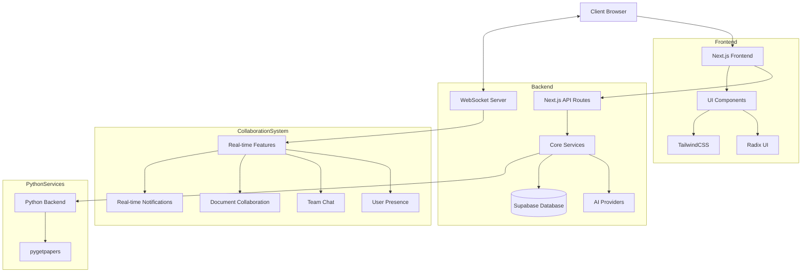
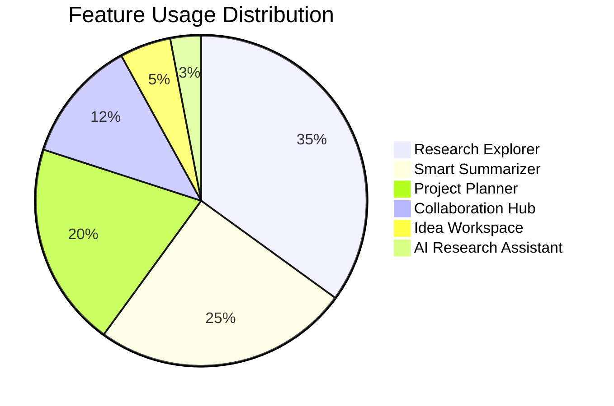

<div align="center">


[](https://nextjs.org/)
[](https://reactjs.org/)
[](https://www.typescriptlang.org/)
[](https://tailwindcss.com/)
[](https://supabase.io/)
[](https://socket.io/)
[](https://github.com/Kedhareswer/ai-project-planner/blob/main/LICENSE)


**Advanced Machine Learning Research Platform**

*Accelerate your research with AI-powered tools for discovery, analysis, and collaboration. Built for researchers, by researchers.*

[Getting Started](#getting-started) • 
[Features](#features) • 
[Installation](#installation) • 
[Usage](#usage) • 
[Technologies](#technologies) • 
[Contributing](#contributing) • 
[License](#license)

</div>

## 📋 Overview

AI Project Planner is a comprehensive research platform designed to streamline the academic research workflow. It combines AI-powered tools for literature review, paper search, summarization, and project planning into a unified interface. With enhanced real-time collaboration features, the platform enables seamless teamwork through secure invitations, role-based permissions, and instant messaging.

<div align="center">
  <table>
    <tr>
      <td align="center" width="33%">
        <br />
        <b>Research Explorer</b>
      </td>
      <td align="center" width="33%">
        <br />
        <b>Smart Summarizer</b>
      </td>
      <td align="center" width="33%">
        <br />
        <b>Project Planner</b>
      </td>
    </tr>
  </table>
</div>

## ✨ Features

### 🔍 Research Explorer
Discover and analyze research papers with AI-powered insights and recommendations.
- Advanced search across multiple academic sources (Crossref, arXiv, Europe PMC)
- Citation management and export
- Semantic paper clustering and visualization
- Research trend analysis with AI insights

### 📄 Smart Summarizer
Generate comprehensive summaries from papers, documents, and web content.
- Text, URL, and file summarization (PDF, DOCX)
- Key points extraction with AI analysis
- Reading time estimation
- Multi-format export options

### 📅 Project Planner
Organize research projects with intelligent task management and timelines.
- Gantt chart visualization
- Task dependencies and tracking
- Milestone management
- Resource allocation

### 💡 Idea Workspace
Generate and develop research ideas with AI-powered brainstorming tools.
- Mind mapping and concept visualization
- Literature gap analysis
- Research question formulation
- Methodology recommendations

### 👥 Collaboration Hub
Work together with real-time features and comprehensive team management.
- Real-time document editing with cursor presence
- Team-based permissions system (Owner, Admin, Editor, Viewer roles)
- Secure invitation system with rate limiting (max 2 teams per day)
- Public/private teams with join request functionality
- Real-time chat with typing indicators and mentions
- Granular notification preferences
- User presence tracking

### 🤖 AI Research Assistant
Get expert guidance powered by multiple AI providers.
- Support for multiple AI providers (Google Gemini, OpenAI, Groq, DeepInfra)
- Methodology recommendations
- Statistical analysis assistance
- Writing improvement suggestions
- Citation formatting

## 🚀 Getting Started

### Prerequisites

- Node.js 18.0 or higher
- Python 3.7+ (for literature review functionality)
- pnpm package manager
- Java Runtime Environment (JRE) for pygetpapers

### Installation

1. Clone the repository
```bash
git clone https://github.com/Kedhareswer/ai-project-planner.git
cd ai-project-planner
```

2. Install frontend dependencies
```bash
pnpm install
```

3. Set up environment variables
```bash
cp env.template .env.local
```
Edit `.env.local` with your API keys and configuration.

4. Set up the Python backend (for literature search functionality)
```bash
cd python
./setup.bat
```

## 🔧 Usage

### Development Server

1. Start the Next.js frontend and WebSocket server:
```bash
pnpm dev:all
```

This will start both the Next.js frontend on port 3000 and the WebSocket server for real-time features.

Open [http://localhost:3000](http://localhost:3000) in your browser.

2. In a separate terminal, start the Python backend (if needed):
```bash
cd python
python app.py
```

The Python backend will run on port 5000 and handle paper search functionality.

### Production Build

```bash
pnpm build
pnpm start:all
```

## 📊 System Architecture



## 📊 Performance Metrics

<div align="center">
  <table>
    <tr>
      <th>Feature</th>
      <th>Processing Time</th>
      <th>Accuracy</th>
    </tr>
    <tr>
      <td>Paper Summarization</td>
      <td>~3 seconds</td>
      <td>92%</td>
    </tr>
    <tr>
      <td>Literature Search</td>
      <td>~5 seconds</td>
      <td>95%</td>
    </tr>
    <tr>
      <td>Idea Generation</td>
      <td>~7 seconds</td>
      <td>88%</td>
    </tr>
    <tr>
      <td>Real-time Collaboration</td>
      <td>&lt;100ms latency</td>
      <td>99.9% uptime</td>
    </tr>
  </table>
</div>

### Feature Usage Distribution



## 🔒 Security & Permissions

<div align="center">
  <table>
    <tr>
      <th>Role</th>
      <th>Permissions</th>
      <th>Can Assign</th>
    </tr>
    <tr>
      <td>Owner</td>
      <td>Full access, team management</td>
      <td>All roles</td>
    </tr>
    <tr>
      <td>Admin</td>
      <td>Team management, invite users</td>
      <td>Editor, Viewer</td>
    </tr>
    <tr>
      <td>Editor</td>
      <td>Edit documents, send messages</td>
      <td>None</td>
    </tr>
    <tr>
      <td>Viewer</td>
      <td>Read-only access</td>
      <td>None</td>
    </tr>
  </table>
</div>

## 🛠️ Technologies

### Frontend
- **Framework**: [Next.js](https://nextjs.org/) 15.2.4
- **UI Library**: [React](https://reactjs.org/) 19
- **Styling**: [TailwindCSS](https://tailwindcss.com/) 3.4
- **Component Library**: [Radix UI](https://www.radix-ui.com/)
- **Charts**: [Recharts](https://recharts.org/)
- **Rich Text Editor**: [Tiptap](https://tiptap.dev/)
- **Real-time Collaboration**: [Yjs](https://yjs.dev/), [Socket.io](https://socket.io/) 4.8.1

### Backend
- **API Routes**: Next.js API Routes
- **Database**: [Supabase](https://supabase.io/)
- **Authentication**: Supabase Auth
- **File Processing**: Mammoth (for docx), pdf-parse
- **Python Services**: Flask, pygetpapers

### AI Integration
- **Models**: Google Gemini (up to 2.5), OpenAI, Groq, DeepInfra
- **Document Processing**: Custom NLP pipelines
- **Literature Analysis**: Python-based analysis tools

## 📂 Project Structure

```
ai-project-planner/
├── app/                  # Next.js app directory
│   ├── ai-assistant/     # AI assistant feature
│   ├── collaborate/      # Team collaboration features
│   ├── explorer/         # Research explorer feature
│   ├── planner/          # Project planning feature
│   ├── summarizer/       # Document summarization feature
│   └── api/              # API routes
├── components/           # Reusable UI components
├── lib/                  # Core services and utilities
│   ├── services/         # Business logic services
│   └── utils/            # Utility functions
├── server/               # WebSocket server for real-time features
├── python/               # Python backend for literature review
├── scripts/              # Database setup and migration scripts
└── public/               # Static assets
```

## 🤝 Contributing

Contributions are welcome! Please feel free to submit a Pull Request.

1. Fork the repository
2. Create your feature branch (`git checkout -b feature/amazing-feature`)
3. Commit your changes (`git commit -m 'Add some amazing feature'`)
4. Push to the branch (`git push origin feature/amazing-feature`)
5. Open a Pull Request

## 📜 License

This project is licensed under the MIT License - see the [LICENSE](https://github.com/Kedhareswer/ai-project-planner/blob/main/LICENSE) file for details.

## 🙏 Acknowledgements

- [Next.js](https://nextjs.org/) - The React Framework
- [TailwindCSS](https://tailwindcss.com/) - For styling
- [Radix UI](https://www.radix-ui.com/) - For accessible components
- [Supabase](https://supabase.io/) - For database and authentication
- [Socket.io](https://socket.io/) - For real-time features
- [pygetpapers](https://github.com/contentmine/pygetpapers) - For literature review functionality

---

<div align="center">
  <p>Built with ❤️ by the AI Project Planner Team</p>
  <p>
    <a href="https://github.com/Kedhareswer/ai-project-planner/issues">Report Bug</a> · 
    <a href="https://github.com/Kedhareswer/ai-project-planner/issues">Request Feature</a>
  </p>
</div>
