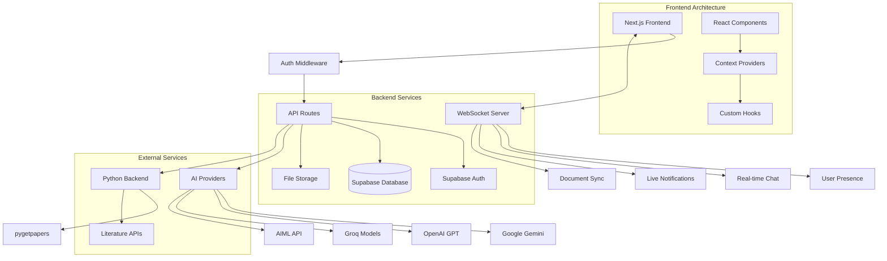

<div align="center">


</div>

<div align="center">

[](https://nextjs.org/)
[](https://reactjs.org/)
[](https://www.typescriptlang.org/)
[](https://tailwindcss.com/)
[](https://supabase.io/)
[](https://socket.io/)
[](https://github.com/Kedhareswer/ai-project-planner/blob/master/LICENSE)

**Advanced AI-Powered Research Platform**

Accelerate your research with intelligent tools for discovery, analysis, collaboration, and project management.

</div>

---

## Table of Contents

- [Overview](#overview)
- [Features](#features)
- [System Architecture](#system-architecture)
- [Getting Started](#getting-started)
- [Project Structure](#project-structure)
- [Technologies](#technologies)
- [API Reference](#api-reference)
- [Security](#security)
- [Performance Metrics](#performance-metrics)
- [Contributing](#contributing)
- [Acknowledgements](#acknowledgements)
- [License](#license)

---

## Overview

AI Research Hub is a comprehensive research platform designed to revolutionize the academic workflow. It integrates advanced AI capabilities, real-time collaboration, and robust project management for researchers and teams.

---

## Features

### Core Features

- **Literature Explorer:** AI-powered paper discovery, topic analysis, and research gap identification.
- **Smart Summarizer:** Summarize documents (PDF, DOCX, text, URLs), extract key points, perform sentiment analysis, and export results.
- **Academic Writer:** Advanced document editor with AI-assisted writing, citation management, and publisher templates.
- **Project Planner:** Organize research projects, manage tasks, track progress, and collaborate.
- **Collaboration Hub:** Real-time teamwork, chat, file sharing, notifications, and flexible team permissions.
- **AI Assistant:** Integrate multiple AI providers (Google Gemini, OpenAI, Groq, DeepInfra, AIML) for research guidance and writing support.

### Writer Features

- **Rich Text Editor:** Advanced document editor with formatting tools and real-time collaboration.
- **AI Writing Assistant:** Context-aware AI assistance with multiple writing personalities (Academic, Technical, Creative).
- **Citation Management:** Import citations from research, generate formatted references in multiple styles (APA, MLA, Chicago, IEEE, Harvard).
- **Publisher Templates:** Support for multiple academic publisher formats (IEEE, ACM, Springer, Elsevier).
- **Grammar & Style Checking:** Integrated language tool for grammar, style, and clarity improvements.
- **Research Integration:** Seamlessly incorporate findings from the Literature Explorer into your documents.

### Additional Features

- **Authentication:** Secure Supabase Auth with middleware protection.
- **Responsive Design:** Mobile-first with Radix UI.
- **Theme Support:** Dark/light modes with system preference detection.
- **Error Boundaries:** Comprehensive error handling.
- **Performance Optimization:** Lazy loading, code splitting, and caching.

---

## System Architecture



---

## Getting Started

### Prerequisites

- **Node.js** 18.0 or higher
- **Python** 3.7+ (for literature search)
- **pnpm** package manager
- **Java Runtime Environment (JRE)** (for pygetpapers)
- **Supabase Account** (for database & authentication)

### Environment Setup

1. **Clone the repository**
   ```bash
   git clone https://github.com/Kedhareswer/ai-project-planner.git
   cd ai-project-planner
   ```

2. **Install frontend dependencies**
   ```bash
   pnpm install
   ```

3. **Configure environment variables**
   ```bash
   cp env.template .env.local
   ```
   Edit `.env.local` with your configuration.

4. **Set up Python Backend**
   ```bash
   cd python
   # For Linux/Mac
   pip install -r requirements.txt
   # For Windows
   setup.bat
   ```

5. **Configure Supabase Database**
   ```bash
   node scripts/run-migration.js
   ```

### Development Server

1. **Start the full development environment**
   ```bash
   node start-dev.js
   # or
   pnpm dev:all
   ```
   - Next.js frontend at `http://localhost:3000`
   - WebSocket server at port `3001`

2. **Start Python backend (separate terminal)**
   ```bash
   cd python
   python app.py
   # or for improved version
   python improved_app.py
   ```
   - Python service runs at `http://localhost:5000`

### Production Deployment

```bash
pnpm build
pnpm start:all
```

---

## Project Structure

```bash
ai-project-planner/
  app/                 # Next.js App Router
    ai-assistant/      # AI assistant interface
    api/               # API routes
    collaborate/       # Team collaboration features
    collaboration/     # Additional collaboration tools
    explorer/          # Research discovery tools
    planner/           # Project management interface
    summarizer/        # Document summarization tools
    writer/            # Writing tools
    writing-assistant/ # Writing assistance features
    login/             # Authentication pages
    signup/            # User registration
    profile/           # User profile management
    settings/          # User settings
  components/          # Reusable UI components
  hooks/               # Custom React hooks
  integrations/        # External service integrations
  lib/                 # Core utilities/services
  services/            # Business logic
  server/              # WebSocket server
  python/              # Python backend services
  scripts/             # Database/setup scripts
  public/              # Static assets
  styles/              # Global styles
  types/               # TypeScript type definitions
```

---

## Technologies

### Frontend Stack

- **Framework:** [Next.js](https://nextjs.org/) 15.2.4 with App Router
- **UI Library:** [React](https://reactjs.org/) 19, [TailwindCSS](https://tailwindcss.com/) 3.4, [Radix UI](https://www.radix-ui.com/)
- **State Management:** [Zustand](https://zustand.js.org/), React Context
- **Forms:** [React Hook Form](https://react-hook-form.com/), [Zod](https://zod.dev/)
- **Charts:** [Recharts](https://recharts.org/)

### Backend Infrastructure

- **API:** Next.js API Routes (TypeScript)
- **Database:** [Supabase](https://supabase.io/) (PostgreSQL)
- **Authentication:** Supabase Auth with JWT
- **Real-time:** [Socket.io](https://socket.io/) 4.8.1
- **File Storage:** Supabase Storage
- **Middleware:** Custom authentication middleware

### AI Integration

- **Providers:** Google Gemini, OpenAI, Groq, DeepInfra, AIML API
- **Processing:** Custom NLP pipelines
- **Content Extraction:** Cheerio for web scraping, Mammoth (DOCX), pdf-parse (PDF)

### Literature Search

- **Backend:** Python Flask + pygetpapers (v1.2.5)
- **Sources:** Europe PMC, arXiv, Crossref, Semantic Scholar

### Development Tools

- **Package Manager:** pnpm
- **Linting:** ESLint + TypeScript
- **Formatting:** Prettier
- **Build:** Next.js compiler + SWC

---

## Security

### Authentication

- **Registration/Login:** Supabase Auth with email verification
- **Session Management:** JWT tokens with secure HTTP-only cookies
- **Route Protection:** Middleware-based authentication checks
- **API Security:** Bearer token validation for API routes

### Data Security

- **Encryption:** All data encrypted at rest and in transit
- **API Keys:** User-managed API keys for AI providers
- **File Upload:** Size limits (10MB) and type validation
- **Rate Limiting:** Team creation and API rate limiting

---

## Performance Metrics

| Feature                | Processing Time     | Success Rate | Concurrency        |
|------------------------|--------------------|--------------|--------------------|
| Document Summarization | 2-5 seconds        | 95%          | 50+ concurrent     |
| Literature Search      | 3-8 seconds        | 98%          | 20+ concurrent     |
| Real-time Chat         | <100ms latency     | 99.9%        | 1000+ users        |
| File Processing        | 1-3 seconds        | 92%          | 25+ concurrent     |

---

## Contributing

We welcome contributions! See our [Contributing Guidelines](CONTRIBUTING.md) for details.

### Code Standards

- Follow TypeScript best practices
- Use ESLint and Prettier configurations
- Write meaningful commit messages
- Add JSDoc comments for functions
- Include error handling

---

## Acknowledgements

### Core Technologies

- [Next.js](https://nextjs.org/) - The React Framework for Production
- [Supabase](https://supabase.io/) - The Open Source Firebase Alternative
- [Radix UI](https://www.radix-ui.com/) - Low-level UI Primitives
- [TailwindCSS](https://tailwindcss.com/) - Utility-First CSS Framework
- [Socket.io](https://socket.io/) - Real-time Communication Engine

### Special Thanks

- Research community for feedback and testing
- Open source contributors and maintainers
- AI provider communities for API access

---

<div align="center">
  <p>Built with ❤️ by Me</p>
  <p>
    <a href="https://github.com/Kedhareswer/ai-project-planner/issues">Report Bug</a> | 
    <a href="https://github.com/Kedhareswer/ai-project-planner/issues">Request Feature</a> | 
    <a href="https://github.com/Kedhareswer/ai-project-planner/discussions">Join Discussion</a>
  </p>
  <p>Last Updated: July 2025</p>
</div>
