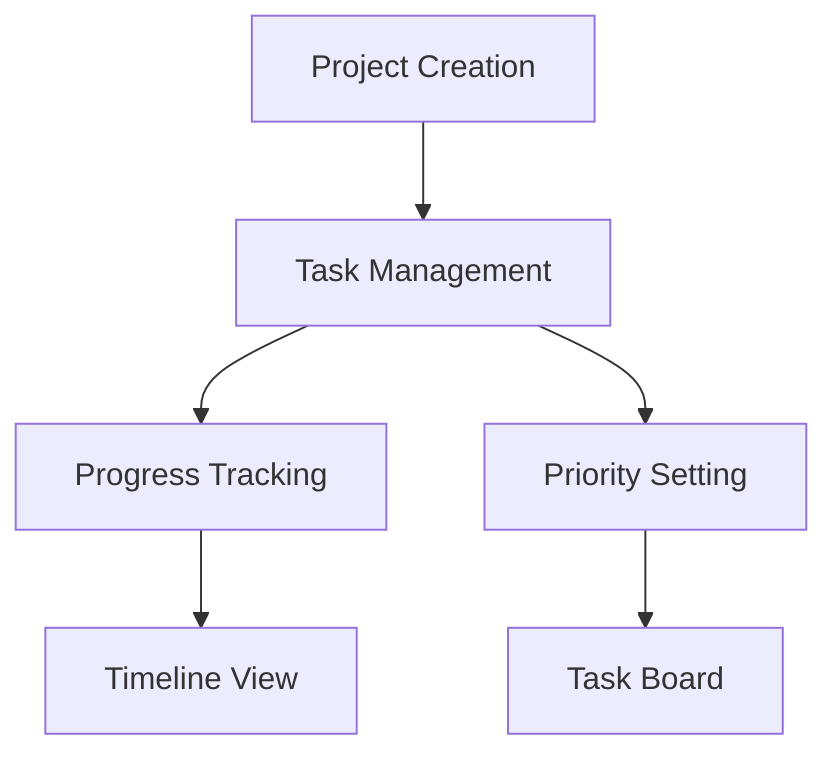
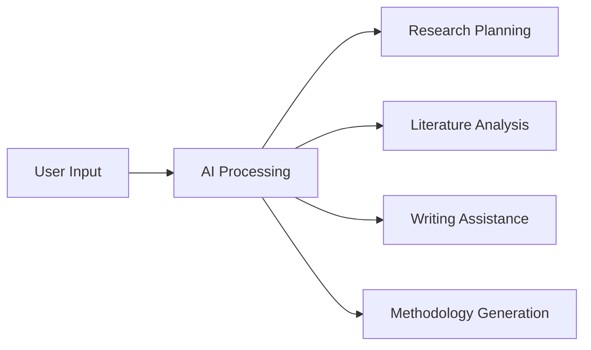

# 🚀 AI Project Planner

[](https://nextjs.org)
[](https://www.typescriptlang.org)
[](https://supabase.com)
[](https://openai.com)
[](LICENSE)

A modern, collaborative research workspace powered by AI that helps teams plan, organize, and execute research projects efficiently. Real-time collaboration meets intelligent assistance to streamline your research workflow.

<p align="center">
  
</p>

## 🌟 Features

### Core Functionality
- 📊 **Project Management**
  - Kanban-style task boards
  - Progress tracking
  - Deadline management
  - Priority-based task organization

- 🤖 **AI Integration**
  - Automated research planning
  - Literature review assistance
  - Methodology framework generation
  - Mind map creation
  - Note-taking suggestions

- 👥 **Team Collaboration**
  - Real-time document sharing
  - Team chat with AI assistance
  - Multi-user editing
  - Research team management

### Research Tools
- 📝 **Writing Assistant**
  - Research paper structuring
  - Citation management
  - Content suggestions
  - Style improvements

- 📚 **Research Planning**
  - Literature review organization
  - Methodology framework
  - Timeline generation
  - Resource allocation

## 🛠️ Tech Stack

- **Frontend**: Next.js, TypeScript, Tailwind CSS
- **Backend**: Supabase
- **AI Integration**: OpenAI API
- **Real-time**: WebSocket
- **Authentication**: Supabase Auth

## 📋 Prerequisites

- Node.js 18.x or later
- npm or yarn
- Supabase account
- OpenAI API key

## ⚙️ Installation

1. **Clone the repository**
   ```bash
   git clone https://github.com/Kedhareswer/ai-project-planner.git
   cd ai-project-planner
   ```

2. **Install dependencies**
   ```bash
   npm install
   # or
   yarn install
   ```

3. **Set up environment variables**
   Create a `.env.local` file:
   ```env
   NEXT_PUBLIC_SUPABASE_URL=your_supabase_url
   NEXT_PUBLIC_SUPABASE_ANON_KEY=your_supabase_anon_key
   OPENAI_API_KEY=your_openai_api_key
   ```

4. **Start the development server**
   ```bash
   npm run dev
   # or
   yarn dev
   ```

5. **Open [http://localhost:3000](http://localhost:3000) in your browser**

## 🔍 Project Structure

```
ai-project-planner/
├── app/
│   ├── components/
│   │   ├── main-nav.tsx
│   │   └── ...
├── components/
│   ├── ai-integration.tsx
│   ├── collaborative-workspace.tsx
│   ├── project-planner.tsx
│   └── projects-overview.tsx
├── public/
├── styles/
├── types/
└── ...
```

## 🎯 Core Features Breakdown

### Project Management


### AI Integration


## 🤝 Contributing

1. Fork the repository
2. Create your feature branch
   ```bash
   git checkout -b feature/amazing-feature
   ```
3. Commit your changes
   ```bash
   git commit -m 'Add some amazing feature'
   ```
4. Push to the branch
   ```bash
   git push origin feature/amazing-feature
   ```
5. Open a Pull Request

## 📄 License

This project is licensed under the MIT License - see the [LICENSE](LICENSE) file for details.

## 🙏 Acknowledgments

- [Next.js](https://nextjs.org) for the amazing React framework
- [Supabase](https://supabase.com) for the backend infrastructure
- [OpenAI](https://openai.com) for AI capabilities
- [Tailwind CSS](https://tailwindcss.com) for styling

---

<p align="center">
  Made with ❤️ by <a href="https://github.com/Kedhareswer">Kedhareswer</a>
</p>
