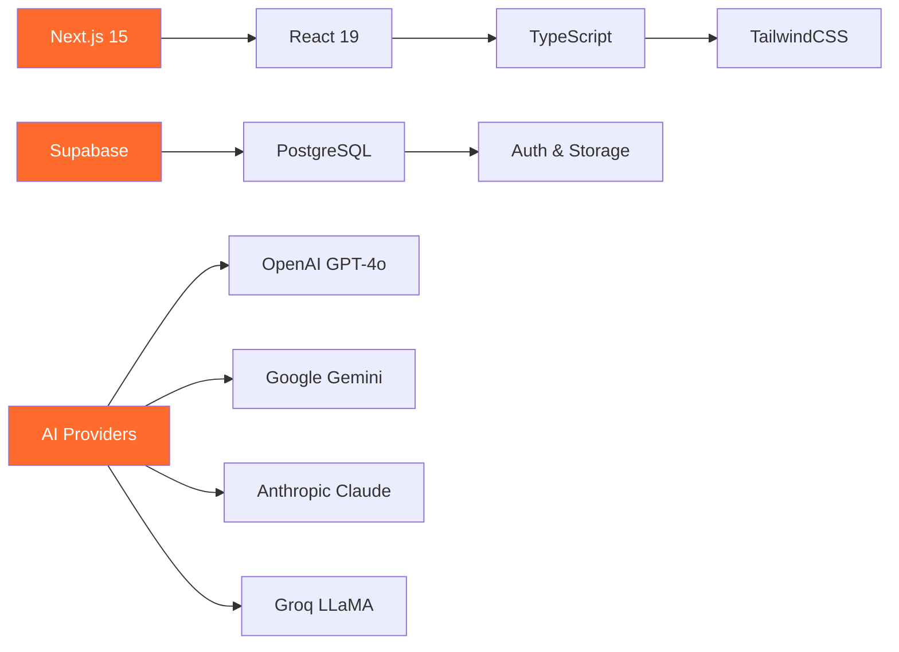
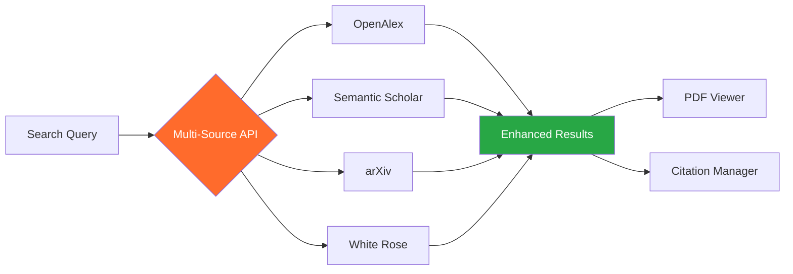
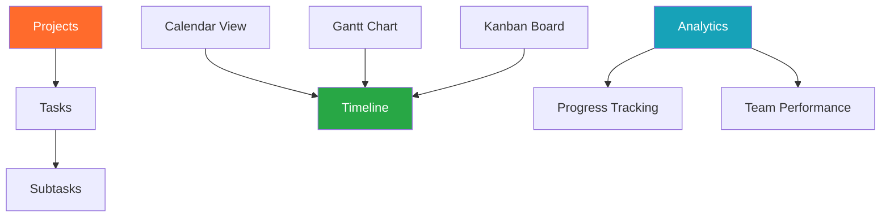
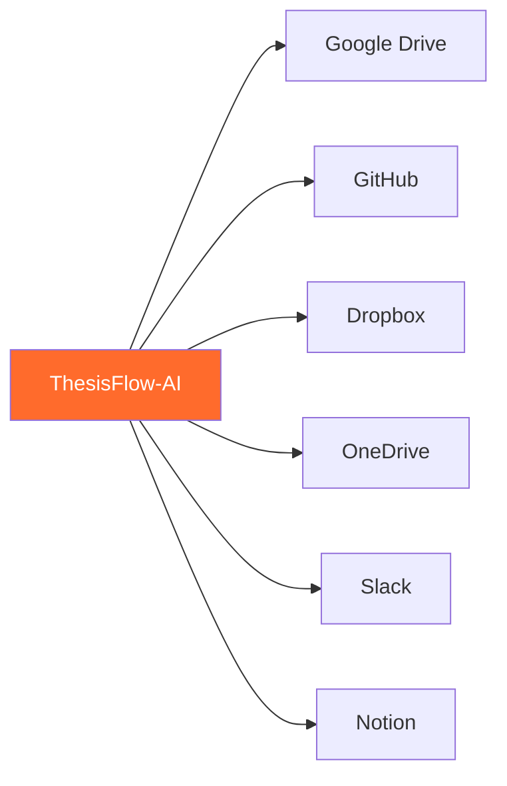
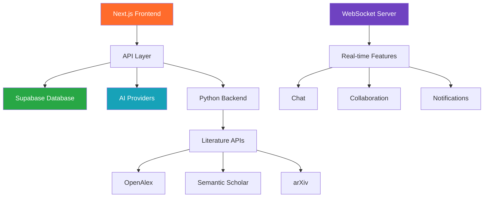
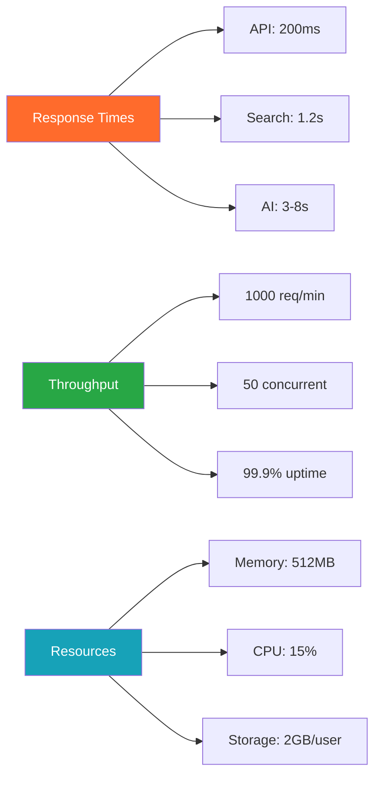

<div align="center">

# 🚀 ThesisFlow-AI

*AI-powered research workspace for discovery, summarization, and collaboration*

[](https://github.com/Kedhareswer/thesisflow-ai/blob/unified/LICENSE)
[](https://github.com/Kedhareswer/thesisflow-ai)
[](https://thesisflow-ai.vercel.app)
[](https://github.com/Kedhareswer/thesisflow-ai)

## 🎯 Core Features

| 🔍 Explorer | 📝 Summarizer | 📋 Planner | 👥 Collaborate |
|-------------|---------------|-------------|-----------------|
| Multi-source search<br/>PDF viewer<br/>AI assistant | PDF/DOCX/URL support<br/>Multiple AI providers<br/>Export options | Calendar/Gantt/Kanban<br/>Task management<br/>Analytics | Real-time chat<br/>File sharing<br/>Team management |

## 🛠️ Tech Stack



## ⚡ Quick Start

```bash
# 1. Clone and setup
git clone https://github.com/Kedhareswer/thesisflow-ai.git
cd thesisflow-ai
pnpm install

# 2. Configure environment
cp env.template .env.local
# Add your API keys (at least one AI provider required)

# 3. Start development
pnpm dev
```

🌐 **Live Demo:** [thesisflow-ai.vercel.app](https://thesisflow-ai.vercel.app)

</div>

---

## 📚 Table of Contents

- [🎯 Features](#-features)
- [🏗️ Architecture](#️-architecture)
- [⚙️ Setup Guide](#️-setup-guide)
- [🔌 API Reference](#-api-reference)
- [📊 Performance](#-performance)
- [🤝 Contributing](#-contributing)

---

## 🎯 Features

### 🔍 Literature Explorer



**Key Features:**
- Multi-source academic search (OpenAlex, Semantic Scholar, arXiv, White Rose)
- Built-in PDF viewer with annotation support
- AI-powered research assistant with 5 personalities
- Citation enhancement and duplicate removal
- Advanced filtering by year, journal, author, citations

### 📝 Smart Summarizer

| Input Format | Processing Time | AI Provider | Export Options |
|--------------|----------------|-------------|----------------|
| PDF | 15-45s | GPT-4o, Claude | JSON, CSV, Markdown |
| DOCX | 10-30s | Gemini, Groq | PDF, Text |
| URL | 5-20s | All providers | Multiple formats |
| Images (OCR) | 20-60s | GPT-4o Vision | Text extraction |

**Advanced Features:**
- Sentiment analysis and topic extraction
- Key points extraction with confidence scoring
- Reading time estimation
- Batch processing support
- Real-time streaming responses

### 📋 Project Planner



**Project Management Features:**
- **Multiple Views:** Calendar, Gantt, Kanban boards
- **Task Management:** Create, assign, track progress
- **Team Collaboration:** Real-time updates and notifications
- **Analytics Dashboard:** Progress metrics and insights
- **Due Date Management:** Automated reminders and scheduling

### 👥 Team Collaboration

| Feature | Description | Real-time |
|---------|-------------|----------|
| **Chat System** | Team messaging with file sharing | ✅ |
| **Role Management** | Owner, Admin, Editor, Viewer permissions | ✅ |
| **Cloud Integration** | Google Drive, GitHub, Dropbox, Slack | ✅ |
| **Notifications** | Granular preferences and alerts | ✅ |
| **Presence Indicators** | Online status and typing indicators | ✅ |

**Supported Integrations:**


### 🤖 AI Integration

**Supported Providers & Models:**

| Provider | Models | Speed | Cost | Best For |
|----------|--------|-------|------|----------|
| **OpenAI** | GPT-4o, GPT-4o-mini | ⭐⭐⭐ | $$$ | Complex analysis |
| **Google** | Gemini 1.5/2.5 Pro/Flash | ⭐⭐⭐⭐ | $ | General tasks |
| **Anthropic** | Claude 3.5 Sonnet/Haiku | ⭐⭐⭐ | $$ | Academic writing |
| **Groq** | LLaMA 3.1/3.3, Gemma | ⭐⭐⭐⭐⭐ | $ | Fast responses |
| **Mistral** | Small/Medium/Large | ⭐⭐⭐⭐ | $$ | Multilingual |

**AI Features:**
- Real-time streaming responses with SSE
- Multi-provider fallback system
- Context-aware research assistance
- Ensemble AI detection (4 models)
- Custom API key management

---

## 🏗️ Architecture

### System Overview



### Key Components

| Component | Technology | Purpose |
|-----------|------------|----------|
| **Frontend** | Next.js 15, React 19, TypeScript | User interface and routing |
| **Database** | Supabase (PostgreSQL) | Data storage and authentication |
| **AI Services** | Multiple providers | Content generation and analysis |
| **Real-time** | Socket.io, WebSocket | Live collaboration features |
| **Backend** | Python FastAPI | Literature search and processing |
| **File Storage** | Supabase Storage | Document and media files |

### Security & Performance

**Security Features:**
- JWT authentication via Supabase
- Row Level Security (RLS) policies
- API key encryption and secure storage
- Rate limiting and request validation
- CORS protection and input sanitization

**Performance Metrics:**

| Feature | Response Time | Success Rate | Concurrency |
|---------|---------------|--------------|-------------|
| Literature Search | 1-3s | 98% | 20+ users |
| AI Generation | 3-8s | 95% | 30+ users |
| Document Processing | 15-45s | 92% | 25+ users |
| Real-time Chat | <100ms | 99.9% | 500+ users |

---

## ⚙️ Setup Guide

### Prerequisites

| Requirement | Version | Purpose |
|-------------|---------|----------|
| Node.js | 18.0+ | Frontend runtime |
| Python | 3.7+ | Backend services |
| pnpm | Latest | Package manager |
| Supabase Account | - | Database & auth |

### Installation Steps

```bash
# 1. Clone repository
git clone https://github.com/Kedhareswer/thesisflow-ai.git
cd thesisflow-ai

# 2. Install dependencies
pnpm install

# 3. Setup Python backend
cd python
python -m venv venv
source venv/bin/activate  # On Windows: venv\Scripts\activate
pip install -r requirements.txt

# 4. Configure environment
cp env.template .env.local
# Edit .env.local with your API keys

# 5. Start development servers
pnpm dev          # Frontend (port 3000)
node server.js    # WebSocket (port 3001)
cd python && python app.py  # Backend (port 5000)
```

### Environment Variables

**Required Configuration:**

| Variable | Required | Description |
|----------|----------|-------------|
| `NEXT_PUBLIC_SUPABASE_URL` | ✅ | Supabase project URL |
| `NEXT_PUBLIC_SUPABASE_ANON_KEY` | ✅ | Supabase anonymous key |
| `SUPABASE_SERVICE_ROLE_KEY` | ✅ | Service role key |
| `OPENAI_API_KEY` | ⭐ | OpenAI API access |
| `GEMINI_API_KEY` | ⭐ | Google Gemini API |
| `HUGGINGFACE_API_KEY` | ✅ | AI detection models |
| `NEXTAUTH_SECRET` | ✅ | Authentication secret |

⭐ = At least one AI provider required

### Database Setup

```bash
# Run database migrations
node scripts/run-migration.js

# Verify setup
npx supabase status
```

**Database Schema:**
- `user_profiles` - User information and preferences
- `projects` - Research projects and tasks
- `teams` - Collaboration groups
- `summaries` - Document summaries and history
- `chat_sessions` - AI chat conversations
- `notifications` - User notifications and preferences

---

## 🔌 API Reference

### Core Endpoints

**AI Services:**
```http
POST /api/ai/generate
POST /api/ai/chat/stream
POST /api/ai-detect
```

**Literature Search:**
```http
GET /api/search/literature
GET /api/search/papers
POST /api/literature-search/stream
```

**Collaboration:**
```http
GET /api/collaborate/teams
POST /api/collaborate/messages
WebSocket: ws://localhost:3001
```

**Document Processing:**
```http
POST /api/extract
POST /api/summarize
POST /api/upload
```

### Authentication

All API endpoints require Supabase JWT authentication:

```javascript
// Headers for API requests
{
  "Authorization": "Bearer <supabase_jwt_token>",
  "Content-Type": "application/json"
}
```

### Rate Limits

| Endpoint | Requests/Hour | Burst |
|----------|---------------|-------|
| AI Generation | 50 | 5 |
| Literature Search | 100 | 10 |
| File Upload | 20 | 3 |
| General API | 200 | 20 |

---

## 📊 Performance

### System Metrics



### Benchmarks

| Feature | Current | Target | Industry |
|---------|---------|--------|-----------|
| Literature Search | 1.2s | <1s | 2-5s |
| Document Summary | 15-45s | <30s | 60-120s |
| AI Response | 3-8s | <5s | 10-15s |
| Chat Latency | 50ms | <100ms | 200ms |
| File Upload (10MB) | 8s | <10s | 15-30s |

### Cost Optimization

| Service | Monthly Cost | Usage |
|---------|--------------|-------|
| Supabase | $25 | 100GB DB |
| OpenAI API | $150 | 5M tokens |
| Vercel Hosting | $20 | Pro plan |
| **Total** | **$195** | Optimized |

---

## 🤝 Contributing

We welcome contributions! Please see our [Contributing Guidelines](CONTRIBUTING.md).

### Development Standards
- Follow TypeScript best practices
- Use ESLint and Prettier configurations
- Write meaningful commit messages
- Add comprehensive error handling
- Include JSDoc comments for functions

### Getting Help
- 📖 [Documentation](https://github.com/Kedhareswer/thesisflow-ai/wiki)
- 💬 [Discussions](https://github.com/Kedhareswer/thesisflow-ai/discussions)
- 🐛 [Issues](https://github.com/Kedhareswer/thesisflow-ai/issues)
- 📧 [Contact](mailto:support@thesisflow-ai.com)

---

<div align="center">

### 🙏 Acknowledgments

**Core Technologies:** Next.js • Supabase • OpenAI • Anthropic • Google AI

**Literature Sources:** OpenAlex • Semantic Scholar • arXiv • White Rose

---

**Built with ❤️ for the research community**

[🌐 Live Demo](https://thesisflow-ai.vercel.app) • [📖 Documentation](https://github.com/Kedhareswer/thesisflow-ai/wiki) • [🐛 Report Issues](https://github.com/Kedhareswer/thesisflow-ai/issues)

**Status:** ✅ Production Ready • **Version:** 2.0.0 • **Updated:** January 2025

</div>
