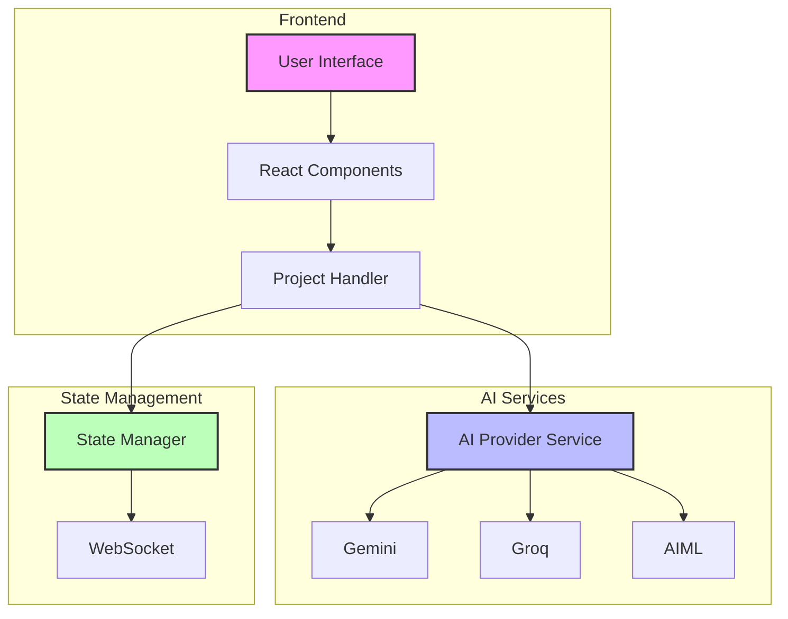
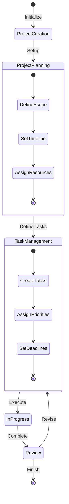
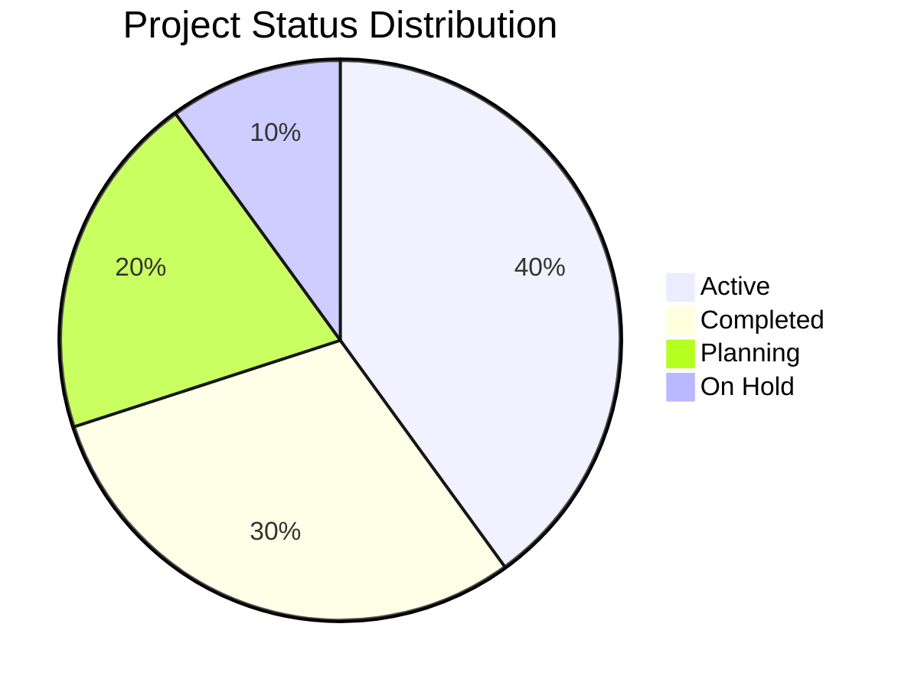
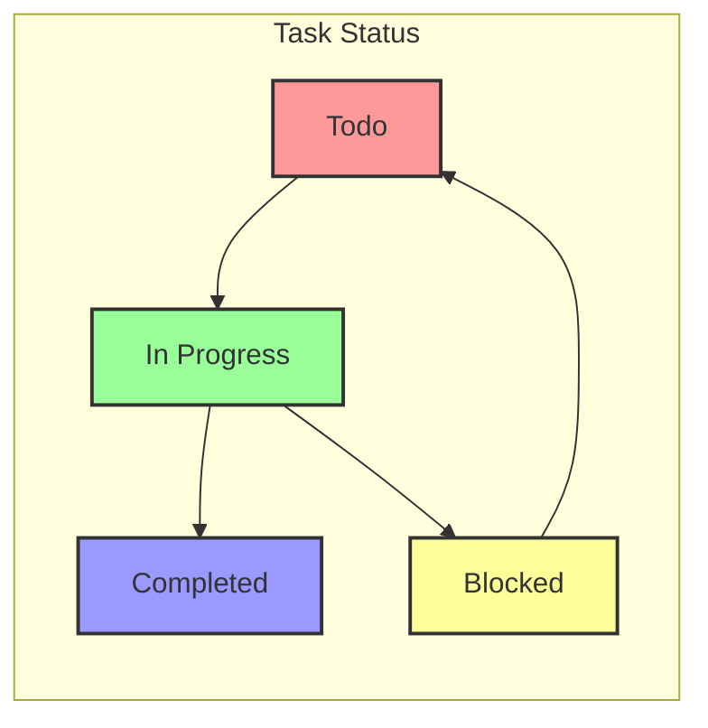
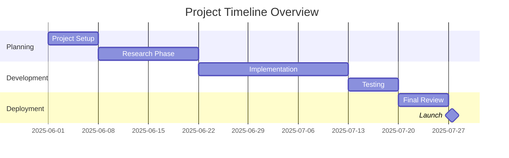
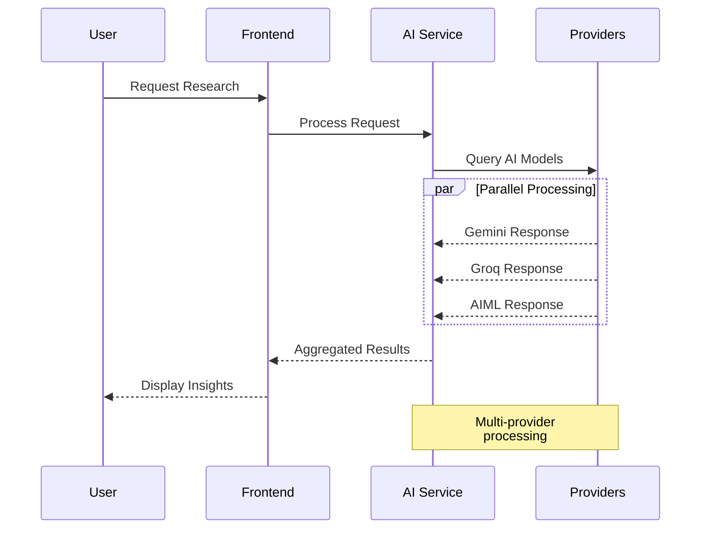
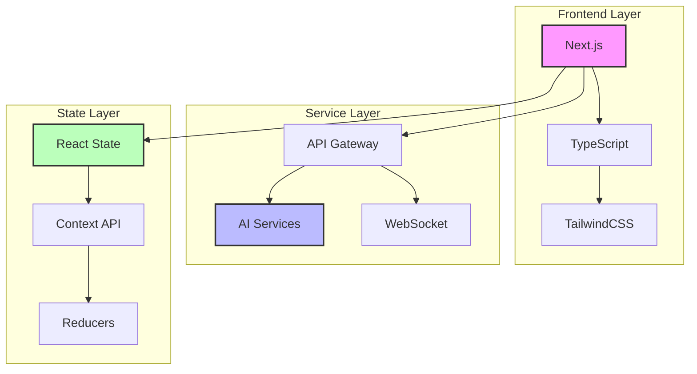
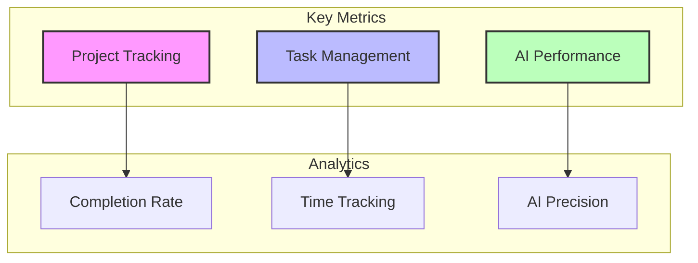
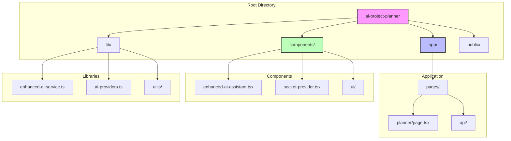

# AI Project Planner 🤖📋

[](https://www.typescriptlang.org/)
[](https://www.python.org/)
[](LICENSE)
[](https://github.com/Kedhareswer/ai-project-planner)
[](https://github.com/Kedhareswer)

A sophisticated project planning and research management platform powered by multiple AI providers (Gemini, Groq, AIML) to help streamline research projects and task management.

<div align="center">

[Getting Started](#-getting-started) · [Features](#-features) · [Documentation](#-documentation) · [Contributing](#-contributing)

</div>

## 📊 System Architecture



## 🔄 Project Lifecycle



## 📈 Project Analytics



### Task Distribution



### Project Timeline



## 🤖 AI Integration Architecture



## 🛠 Technology Stack



## 📊 Performance Metrics



## 🌟 Features

### Project Management
- **Project Organization**
  - Create and manage multiple research projects
  - Track project progress and deadlines
  - Set project start and end dates
  - Monitor project completion status

### Task Management
- **Comprehensive Task Tracking**
  - Create and assign tasks within projects
  - Set task priorities and deadlines
  - Track estimated hours for tasks
  - Monitor task status (Todo, In Progress, Completed)
  - Visual progress indicators

### AI-Powered Research Assistant
- **Multi-Provider AI Integration**
  - Support for multiple AI providers (Gemini, Groq, AIML)
  - Compare responses across different AI models
  - Advanced AI configuration options

### Analytics & Insights
- **Project Analytics**
  - Project completion statistics
  - Task distribution analysis
  - Progress tracking
  - Deadline monitoring

## 🚀 Getting Started

1. **Clone the repository**
```bash
git clone https://github.com/Kedhareswer/ai-project-planner.git
cd ai-project-planner
```

2. **Install dependencies**
```bash
npm install
```

3. **Configure environment variables**
```bash
cp .env.example .env.local
```

4. **Set up environment variables**
```env
NEXT_PUBLIC_AI_PROVIDER_KEY=your_api_key
NEXT_PUBLIC_WEBSOCKET_URL=ws://localhost:3000
```

5. **Run the development server**
```bash
npm run dev
```

## 📐 Project Structure



## 🤝 Contributing

We welcome contributions! Please follow these steps:

1. Fork the repository
2. Create your feature branch (`git checkout -b feature/AmazingFeature`)
3. Commit your changes (`git commit -m 'Add some AmazingFeature'`)
4. Push to the branch (`git push origin feature/AmazingFeature`)
5. Open a Pull Request

## 📝 License

This project is licensed under the MIT License - see the [LICENSE](LICENSE) file for details.

## 📈 Stats & Metrics

- **Project Status**: Active Development
- **Last Updated**: 2025-06-11 20:11:23 UTC
- **Maintained by**: @Kedhareswer
- **Version**: 1.0.0

## 🙏 Acknowledgments

- All AI providers (Gemini, Groq, AIML) for their powerful APIs
- The open-source community for various tools and libraries
- Contributors and maintainers

---

<div align="center">

**[Documentation](docs/) · [Report Bug](../../issues) · [Request Feature](../../issues)**

</div>

---

<div align="center">
<sub>Last Updated: 2025-06-11 20:11:23 UTC by @Kedhareswer</sub>
</div>
