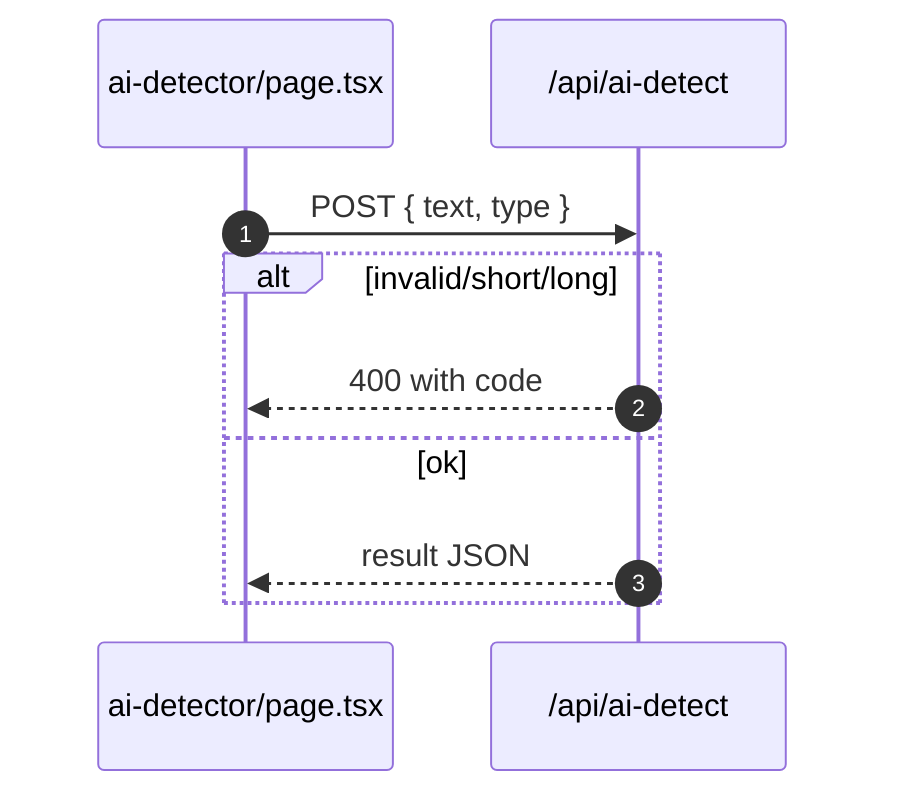

# AI Detector (Academic)

- Sources: `app/ai-detector/page.tsx`, `app/api/ai-detect/route.ts`

## What is here
- Enter text and analyze whether it’s AI-generated, with confidence and reliability.

## Why it is used
- Provide an academic-focused AI detection tool with word limits and clear errors.

## How it works
- Client validates length and posts to `/api/ai-detect`.
- API enforces word limits (≥10, ≤10000), 30s timeout using `AbortController`, and returns structured results.

## Authentication and Authorization
- Page protected by `middleware.ts` (`/ai-detector`).
- API is public/auth-agnostic in code shown (can be fronted by route protection or token checks if needed).

## Security Practices
- Strict input validation and timeouts; adds cache-busting headers.

## Data Storage
- None by default.

## Billing / Tokens
- None by default.

## Middleware
- Route protection only.

## Error Handling
- Returns specific error codes: `INVALID_INPUT`, `TEXT_TOO_SHORT`, `TEXT_TOO_LONG`, `TIMEOUT`, `DETECTION_ERROR`.

## Tests
- Unit: word counting and error branches; timeout behavior.
- Black box: POST endpoint happy path and each error code branch.

## Sequence

## Related Files
- `app/ai-detector/page.tsx`
- `app/api/ai-detect/route.ts`
