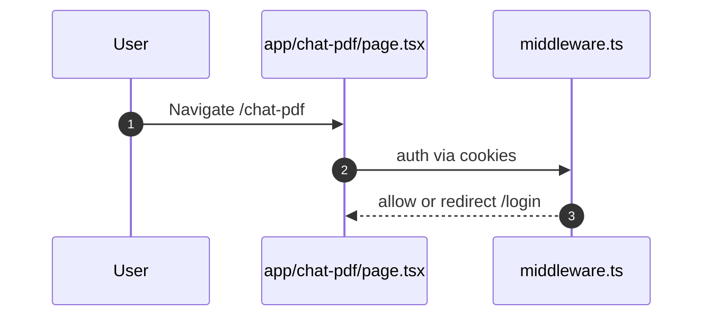

# Chat with PDF

- Source: `app/chat-pdf/page.tsx`

## What is here
- Placeholder UI indicating "Coming Soon" with sidebar and basic layout.

## Why it is used
- Stub page reserved for future PDF-grounded chat.

## How it works
- No upload or API call yet; static content and layout.

## APIs & Integrations
- None currently wired.

## Authentication and Authorization
- Protected by `middleware.ts` (`/chat-pdf`).

## Security Practices
- N/A yet (no network calls).

## Data Storage
- N/A.

## Billing / Tokens
- N/A.

## Middleware
- Route protection only.

## Error Handling
- None.

## Tests
- Unit: render placeholder state.
- Black box: protected route redirects unauthenticated users to `/login`.

## Sequence

## Related Files
- `app/chat-pdf/page.tsx`
- `middleware.ts`
