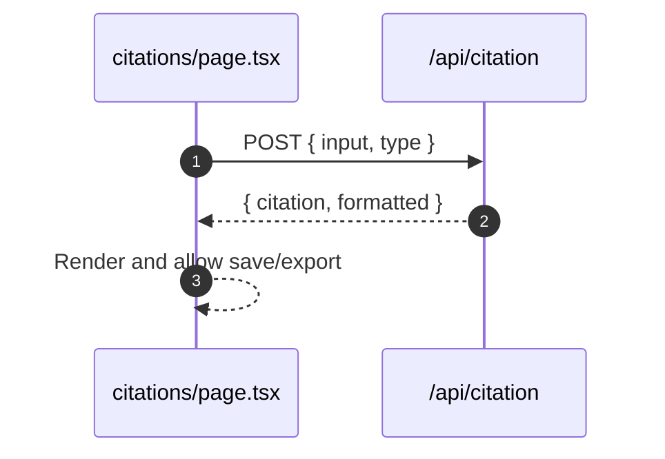

# Citation Generator

- Source: `app/citations/page.tsx`

## What is here
- Generate a single citation by DOI/URL or manual fields. Save to bibliography collections, export CSL-JSON/RIS/BibTeX.

## Why it is used
- Simplify citation creation and library management.

## How it works
- POSTs to `/api/citation` with `{ input, type: 'auto'|'doi'|'url' }`.
- Formats returned into selected style (APA/MLA/Chicago/Harvard/IEEE/Vancouver/BibTeX).
- Bibliography items saved via `bibliographyService` to Supabase.

## APIs & Integrations
- `app/api/citation/route.ts` fetches citation via `citationService.fetchFromDOI/URL` and formats with `citationService.formatCitation`.

## Authentication and Authorization
- Page protected by `middleware.ts` (`/citations`).

## Security Practices
- Input validation server-side for `input` presence; 404 with message if not resolvable.

## Data Storage
- Tables: `citation_collections`, `citation_items`.

## Billing / Tokens
- None.

## Middleware
- Route protection only.

## Error Handling
- Toasts for save/rename/move operations. API returns 400/404/500 with clear messages.

## Tests
- Unit: style formatter selection; manual entry formatting.
- Black box: `/api/citation` doi/url happy path and failure (404).

## Sequence

## Related Files
- `app/citations/page.tsx`
- `app/api/citation/route.ts`
- `lib/services/citation.service.ts`
