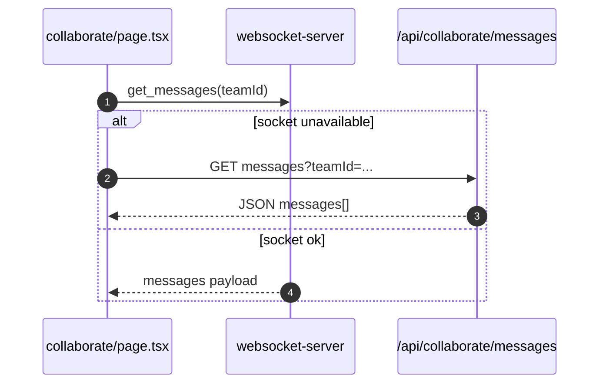

# Collaborate

- Source: `app/collaborate/page.tsx`

## What is here
- Teams, messages with mentions, reactions, presence, files, invitations, notifications, and settings.
- Uses app-level socket service: `useSocket` from `lib/services/socket.service` (not shown here), and REST fallbacks.

## Why it is used
- Real-time collaboration hub for teams within ThesisFlow-AI.

## How it works
- Loads teams via socket `get_user_teams` or fallback `/api/collaborate/teams`.
- Loads messages via socket `get_messages` or fallback `/api/collaborate/messages`.
- Sends messages via `collaborateService.sendMessage(...)` (REST).
- Presence update via socket `update-status`; presence fetch via `get_team_presence`.
- File mentions loaded from `/api/collaborate/files`.

## APIs & Integrations (directories verified)
- `app/api/collaborate/teams/*`, `team-members/*`, `invitations/*`, `messages/*`, `reactions/*`, `files/*`, `presence/*`, `notifications/*`, `notification-preferences/*`, `join-requests/*`, `cloud-integrations/*`.

## Authentication and Authorization
- Page protected by `middleware.ts` (`/collaborate`).
- All collaborate APIs require Supabase bearer token; the page uses `useSupabaseAuth()`.

## Security Practices
- Mentions mapping resolves only to team members/files; avoids leaking unscoped data.
- Socket calls guarded by server; REST fallbacks return only team-scoped data.

## Data Storage
- Core tables: `teams`, `team_members`, `team_invitations`, `team_files`, `team_shared_links`, `chat_messages` (plus presence tables).

## Billing / Tokens
- Collaboration features do not use tokens.

## Middleware
- Route protection only.

## Error Handling
- Toasts on all operations; socket timeouts fall back to REST.

## Tests
- Unit: message reducers, mentions mapping, presence UI.
- Black box: team invite accept/reject via `/api/collaborate/invitations` and message send/receive loop.

## Sequence (messages fallback)

## Related Files
- `app/collaborate/page.tsx`
- `app/api/collaborate/*`
