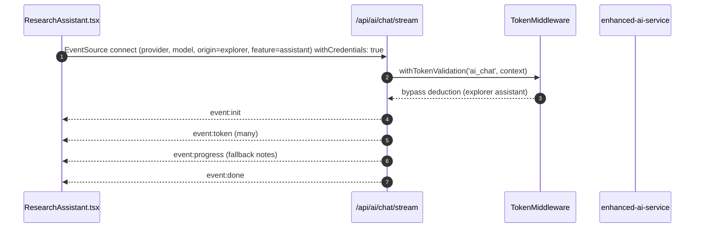

# Explorer (Research Explorer)

- Source: `app/explorer/page.tsx`
- Key components: `./components/EnhancedLiteratureSearch`, `./components/TopicExplorer`, `./components/IdeaGenerator`, `./components/ResearchAssistant`, `./components/IdeasWorkspace`

## What is here
- Tabbed research workspace: Search, Explore, Ideas, Assistant, Session.
- Session context via `ResearchSessionProvider` and `ResearchSessionManager`.
- Sidebar from `app/ai-agents/components/Sidebar`.

## Why it is used
- Unified discovery and ideation surface: search papers, generate topics/ideas, and chat with an AI assistant.

## Recent Updates (October 2025)

### Research Assistant Improvements
- **Fixed personality mode display** - Now shows dynamic personality with icon instead of hardcoded "(Concise mode)"
- **Upgraded personality selector** - Replaced broken DropdownMenu with functional Select component
- **Enhanced UX** - Better visual feedback for active personality selection
- Files updated: `app/explorer/components/ResearchAssistant.tsx:495-503`, `ResearchAssistant.tsx:653-691`

### Ideas Generator Enhancements
- **Saved Ideas Navigation** - Added functional tab system to switch between "Generate" and "Saved Ideas" views
- **Ideas Workspace Integration** - Clicking "Saved Ideas" now properly displays the IdeasWorkspace component
- **Improved State Management** - Added `activeTab` state with proper conditional rendering
- Files updated: `app/explorer/components/IdeaGenerator.tsx:99`, `IdeaGenerator.tsx:286-307`, `IdeaGenerator.tsx:310-688`

## How it works
- Client page with `Tabs`. Active tab state and optional initial `query` from URL.
- Assistant tab uses `ResearchAssistant.tsx`, which streams AI chat via Nova AI service (multi-model architecture with 7 specialized Groq models) using secure authentication methods.
- Ideas Generator tab features two sub-tabs: "Generate" for creating new ideas and "Saved Ideas" for managing workspace
- Authentication uses one of these secure approaches: (1) fetch-based SSE client (ReadableStream + eventsource parser) with Authorization header, (2) HttpOnly, SameSite=strict session cookies, or (3) short-lived one-time SSE tokens minted server-side.

## APIs & Integrations
- SSE: `app/api/ai/chat/stream/route.ts` (auth via `withTokenValidation('ai_chat', ...)`, SSE events `init`, `token`, `progress`, `done`, `error`, `ping`) with provider fallback.
- Token Middleware: `lib/middleware/token-middleware.ts` bypasses token deduction (billing) only for `ai_chat` when `origin=explorer` and `feature=assistant`; authentication, quotas, and rate limits still apply to prevent abuse.
- Client Service: `lib/ai-providers.ts` for SSE and provider/model selection.

## Authentication and Authorization
- Page is protected by `middleware.ts` (`/explorer`).
- SSE route authenticates via HTTP-only cookies using `withCredentials: true` (no tokens in query string); `withTokenValidation()` enforces tokens and rate limits unless explorer bypass applies.

## Security Practices
- Authentication tokens are never exposed in URLs (query params expose tokens via logs, referers, etc.).
- Recommended authentication methods: Authorization header (Bearer token), secure HttpOnly SameSite cookies, or short-lived tokens with refresh flows.
- Server-side validation occurs for all requests regardless of authentication method.
- Long-running connections send `ping` heartbeats every 15s to maintain stability and detect disconnections.

## Data Storage
- Session/ideas stored in in-memory state and `ResearchSessionProvider`.
- No DB writes from this page by default; other tabs may call services (not detailed here).

## Billing / Tokens
- Assistant tab: bypass (no deduction) via `TokenMiddleware` explorer rule.
- Other explorer actions may deduct depending on feature context (see `docs/tokens.md`).

### Analytics
- Even when the Assistant bypasses billing, usage is still recorded for analytics with `tokens_charged = 0` in `public.usage_events`. This ensures Explorer activity is visible in charts without affecting token balances.
- The analytics API (`/api/usage/analytics/v2`) supports dimensions: `service`, `feature`, `provider`, `model`, `api_key_owner`, `api_key_provider`. Providers are normalized so OpenRouter-based entries show as `NOVA` in the UI.

## Middleware
- `middleware.ts` protects `/explorer`.
- `withTokenValidation()` on SSE endpoint; explorer bypass condition is explicit in code.

## Error Handling
- `ResearchAssistant.tsx` handles `onError` from SSE and shows toast.
- SSE route implements provider fallback and emits `error` before closing.

## Tests
- Unit: tab switching and component rendering; mock `AIProviderService.streamChat`.
- Black box: SSE handshake and receipt of `init/token/done` events; abort handling closes connection.

## Sequence (Assistant tab)

## Related Files
- `app/explorer/page.tsx`
- `app/explorer/components/ResearchAssistant.tsx`
- `app/api/ai/chat/stream/route.ts`
- `lib/ai-providers.ts`
- `lib/middleware/token-middleware.ts`
