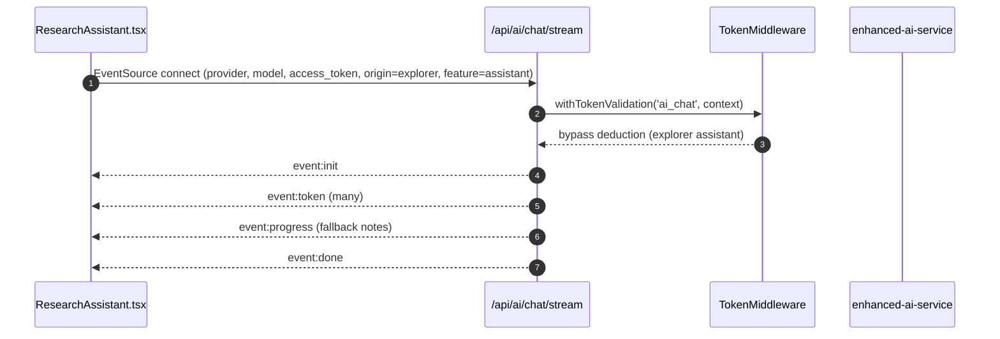

# Explorer (Research Explorer)

- Source: `app/explorer/page.tsx`
- Key components: `./components/EnhancedLiteratureSearch`, `./components/TopicExplorer`, `./components/IdeaGenerator`, `./components/ResearchAssistant` (we reviewed `ResearchAssistant.tsx`)

## What is here
- Tabbed research workspace: Search, Explore, Ideas, Assistant, Session.
- Session context via `ResearchSessionProvider` and `ResearchSessionManager`.
- Sidebar from `app/ai-agents/components/Sidebar`.

## Why it is used
- Unified discovery and ideation surface: search papers, generate topics/ideas, and chat with an AI assistant.

## How it works
- Client page with `Tabs`. Active tab state and optional initial `query` from URL.
- Assistant tab uses `ResearchAssistant.tsx`, which streams AI chat via `AIProviderService.streamChat()` using EventSource to `GET /api/ai/chat/stream`.
- `AIProviderService.streamChat()` attaches Supabase auth token as a query param and forwards `origin=explorer&feature=assistant` to enable middleware bypass for free exploration.

## APIs & Integrations
- SSE: `app/api/ai/chat/stream/route.ts` (auth via `withTokenValidation('ai_chat', ...)`, SSE events `init`, `token`, `progress`, `done`, `error`, `ping`) with provider fallback.
- Token Middleware: `lib/middleware/token-middleware.ts` bypasses deduction only for `ai_chat` when `origin=explorer` and `feature=assistant`.
- Client Service: `lib/ai-providers.ts` for SSE and provider/model selection.

## Authentication and Authorization
- Page is protected by `middleware.ts` (`/explorer`).
- SSE route authenticates via Supabase access token in query string; `withTokenValidation()` enforces tokens and rate limits unless explorer bypass applies.

## Security Practices
- No secrets in client. SSE uses `access_token` query and server-side validation.
- Long-running connections send `ping` heartbeats every 15s to maintain stability.

## Data Storage
- Session/ideas stored in in-memory state and `ResearchSessionProvider`.
- No DB writes from this page by default; other tabs may call services (not detailed here).

## Billing / Tokens
- Assistant tab: bypass (no deduction) via `TokenMiddleware` explorer rule.
- Other explorer actions may deduct depending on feature context (see `docs/tokens.md`).

## Middleware
- `middleware.ts` protects `/explorer`.
- `withTokenValidation()` on SSE endpoint; explorer bypass condition is explicit in code.

## Error Handling
- `ResearchAssistant.tsx` handles `onError` from SSE and shows toast.
- SSE route implements provider fallback and emits `error` before closing.

## Tests
- Unit: tab switching and component rendering; mock `AIProviderService.streamChat`.
- Black box: SSE handshake and receipt of `init/token/done` events; abort handling closes connection.

## Sequence (Assistant tab)

## Related Files
- `app/explorer/page.tsx`
- `app/explorer/components/ResearchAssistant.tsx`
- `app/api/ai/chat/stream/route.ts`
- `lib/ai-providers.ts`
- `lib/middleware/token-middleware.ts`
