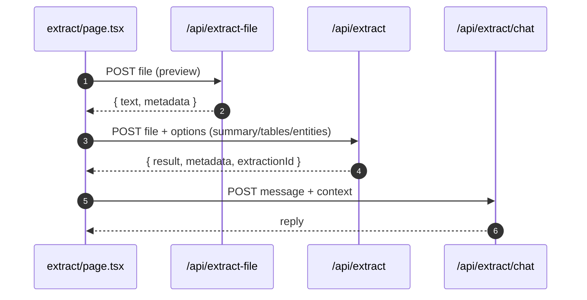

# Extract Data

- Source: `app/extract/page.tsx`

## What is here
- File upload and chat about extracted content. Previews text/PDF/image/CSV, shows tables/entities, exports CSV/JSON.

## Why it is used
- Convert files into structured insight and interact with a document-aware chat.

## How it works
- Upload path: `POST /api/extract` with multipart form-data (file + options). Validates size ≤ 10MB and supported types; orchestrates extraction and writes optional DB record.
- Quick server-side preview: `POST /api/extract-file` returns text and metadata (PDF/Word/PPTX processing included) for UI preview.
- Document chat: `POST /api/extract/chat` with `{ message, context }`, uses OpenRouter fallback.

## APIs & Integrations
- `app/api/extract/route.ts` (ExtractionOrchestrator, DataExtractionService, Supabase admin insert to `extractions`).
- `app/api/extract-file/route.ts` (PDF via `pdf-parse`, DOCX via `mammoth`, PPTX via `PptxExtractor`, optional OCR path via `FileProcessorWithOCR`).
- `app/api/extract/chat/route.ts` (OpenRouter fallback order).

## Authentication and Authorization
- Page protected by `middleware.ts` (`/extract`).
- `/api/extract` uses `requireAuth` (server) and Supabase admin credentials for DB persistence.
- `/api/extract/chat` uses `requireAuth` from `@/lib/auth-utils`.

## Security Practices
- File size checks and supported-type allowlist.
- Server-side parsing avoids recursion; sanitizes errors before returning.

## Data Storage
- Table: `extractions` (user_id, file metadata, result_json).

## Billing / Tokens
- Not charged by default in code shown; depends on environment.

## Middleware
- Route protection; API auth helpers.

## Error Handling
- Server returns 413 for large uploads, 422 for unreadable content, structured error JSON everywhere.

## Tests
- Unit: CSV/JSON export, preview parsers, chat service handler.
- Black box: POST `/api/extract` happy path and large file (413) case.

## Sequence

## Related Files
- `app/extract/page.tsx`
- `app/api/extract/route.ts`
- `app/api/extract-file/route.ts`
- `app/api/extract/chat/route.ts`
