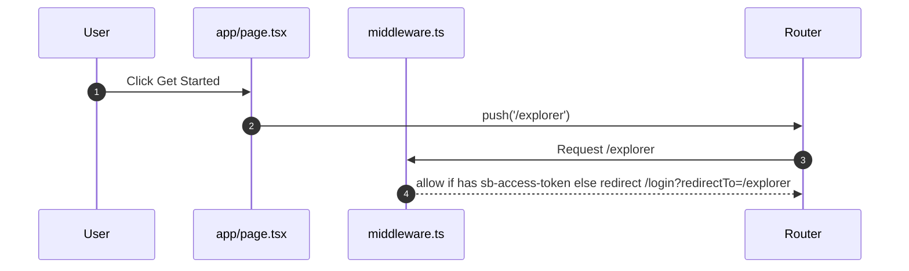

# Home

- Source: `app/page.tsx`

## What is here
- Marketing-focused landing with hero, research stacking cards, stats carousel, benefits, target audiences, pricing and FAQ.
- Buttons route to protected pages like `/explorer` and `/planner`.
- Uses `Footer`, `Pricing`, `FeaturesSectionWithHoverEffects`, `AccordionComponent`, `ResearchHeroWithCards`, `StatsCarouselCount` components.
- Features actual ThesisFlow-AI product screenshots in stacking card animations.

## Why it is used
- Entry point to introduce ThesisFlow-AI and funnel authenticated users into core tools.

## How it works
- Client component with Next.js App Router.
- Uses `useSupabaseAuth()` to check session and `useRouter()` to push protected links via `handleProtectedAction()`.
- Image backgrounds via `next/image` and subtle Framer Motion animations.
- **Research Hero Section**: GSAP-powered text reveal animation with "RESEARCH" text split
- **Stacking Cards**: Scroll-triggered animations showcasing 5 key features with actual product screenshots
- **Stats Carousel**: Animated counter component displaying ThesisFlow-AI metrics (papers processed, workflow acceleration, uptime)
- **Benefits Section**: Customized for research workflows with multi-source discovery, extraction, planning, and collaboration

## Authentication and Authorization
- The page itself is public.
- Navigation to protected routes is enforced by `middleware.ts` which checks Supabase auth cookies: `sb-access-token`, `supabase-auth-token`, `sb-auth-token`.

## Security Practices
- API pages are marked non-indexable in `middleware.ts` by setting `X-Robots-Tag` on `/api/*`.
- CTA buttons rely on client session check; server-enforced protection resides in `middleware.ts`.

## Data Storage
- None directly. Marketing UI only.

## Billing / Tokens
- None on this page. Tokens management detailed in `docs/tokens.md`.

## Middleware
- `middleware.ts` redirects unauthenticated users if they navigate to protected routes.

## Error Handling
- Minimal; navigation guard via `handleProtectedAction()` redirects to `/login` if no session.

## Tests
- Unit: render hero components and ensure buttons exist.
- Black box: unauthenticated navigation to `/explorer` should redirect to `/login`.

## Sequence

## Related Files
- `app/page.tsx`
- `middleware.ts`
