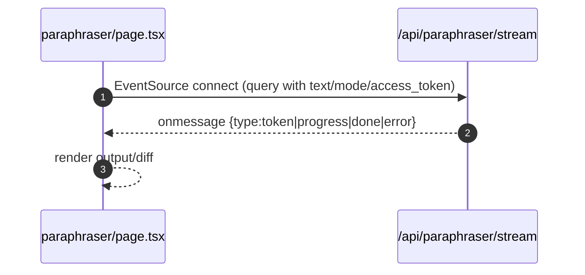

# Paraphraser

- Source: `app/paraphraser/page.tsx`

## What is here
- Two-pane paraphraser with streaming output and diff highlighting (word/sentence), presets (Academic, Fluent, etc.).

## Why it is used
- Quickly rewrite text preserving meaning with clearly surfaced changes.

## How it works
- Always-on SSE streaming via `EventSource` to `/api/paraphraser/stream?text=...&mode=...&preserveLength=...&variationLevel=...&access_token: xxxxx
- Tracks progress percentage and token chunks; stop button closes the EventSource.
- UI supports copying, using output as input, and highlighting changes.

## APIs & Integrations
- Expected SSE: `/api/paraphraser/stream` (referenced in code). Note: route not found in current repository—this page assumes it exists in your environment.

## Authentication and Authorization
- Page protected by `middleware.ts` (`/paraphraser`).
- SSE is expected to authenticate via `access_token` query param.

## Security Practices
- Client limits input to 500 words for performance; SSE timeout/error handled client-side.

## Data Storage
- None by default.

## Billing / Tokens
- Token deduction depends on SSE route implementation. Not determined here.

## Middleware
- Route protection only.

## Error Handling
- Graceful handling of SSE `error` event, toasts on failures, ability to stop stream.

## Tests
- Unit: diff rendering functions; SSE handler parsing; UI controls.
- Black box: stream start/stop and error conditions when SSE is reachable.

## Sequence

## Related Files
- `app/paraphraser/page.tsx`
