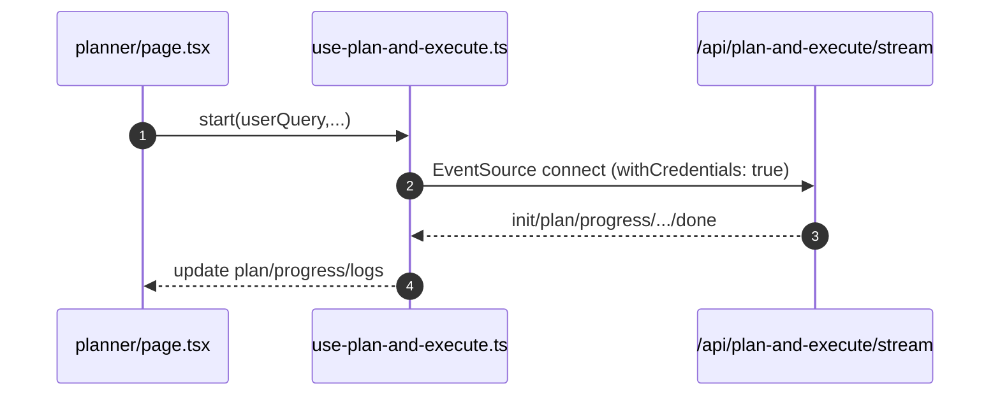

# Planner

- Sources: `app/planner/page.tsx`, hook `hooks/use-plan-and-execute.ts`

## What is here
- Auto planner to generate a plan (SSE), edit tasks, compute schedule/Gantt, and apply to projects/tasks.
- Analytics dashboard via `AnalyticsService`.

## Why it is used
- Convert a research query into an actionable plan and schedule with trackable tasks.

## How it works
- Starts streaming with `usePlanAndExecute.start({ userQuery, ... })` which first tries EventSource to `GET /api/plan-and-execute/stream` with cookie authentication and falls back to `POST /api/plan-and-execute` with manual stream parsing.
- Authentication is handled via Authorization header (`Bearer <token>`) or HttpOnly cookies. Since native EventSource cannot send custom headers, the implementation uses either an EventSource polyfill that supports headers or a fetch-based streaming fallback that can set the Authorization header when using the POST endpoint.
- Hook exposes `lastEvent`, `progress`, `plan`, `logs`, `isStreaming`, and supports `stop/reset`.
- Page computes schedule blocks and persists server drafts to `/api/planner/drafts` (when configured) with Supabase auth header.
- Implements buffer overflow protection (1MB limit) to prevent memory leaks from malformed streams.

## APIs & Integrations
- Streaming: `/api/plan-and-execute/stream` (not found in this repo snapshot; the hook expects this endpoint), SSE events include `init`, `plan`, `progress`, `deep_progress`, `deep_research_complete`, `done`, `error`.
- Apply plan: `/api/planner/apply` (page calls it; verify presence in your repo for environment).
- Analytics: `lib/services/analytics.service.ts` reads `projects`, `tasks`, `task_comments` and derives metrics.
- OpenRouter planning helpers: `lib/services/openrouter.service.ts` for fallback JSON plan generation when used.

## Authentication and Authorization
- Page protected by `middleware.ts` (`/planner`).
- All planner APIs require Supabase bearer token.

## Security Practices
- Idempotency keys for apply (`idempotencyKey`), explicit rate-limit handling with Retry-After.
- Input validation: `maxIterations` clamped to 1-5, `description` type-checked, prevents runaway workloads.
- Buffer overflow protection in streaming hook (1MB limit) prevents memory exhaustion attacks.
- Controlled React state for form inputs (no direct DOM access via getElementById).
- Use of server drafts `public.planner_drafts` for cross-device continuity (see migration `supabase/migrations/20250921113000_create_planner_drafts.sql`).

## Data Storage
- Projects/tasks/comments tables (via `project.service`), `planner_drafts` for persisted plan JSON.

## Billing / Tokens
- Streaming planning may use tokens depending on feature flag (check your environment). Not bypassed like explorer assistant.

## Middleware
- `middleware.ts` for route protection. Token middleware may wrap `/api/plan-and-execute` endpoints in your environment.

## Error Handling
- Hook captures SSE errors and writes them to `logs` and `error`. Page toasts around apply, drafts, schedule.

## Tests
- Unit: hook state machine for `init → progress → done`; schedule computation and Gantt generation.
- Black box: streaming handshake and apply happy path with Supabase-authenticated user.

## Sequence

## Related Files
- `app/planner/page.tsx`
- `hooks/use-plan-and-execute.ts`
- `lib/services/analytics.service.ts`
- `lib/services/openrouter.service.ts`
