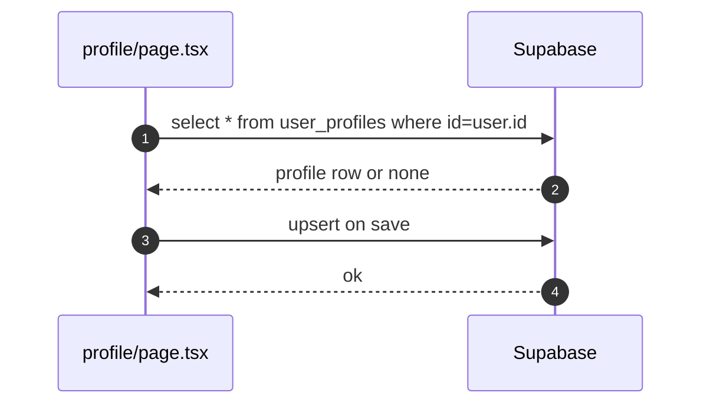

# Profile

- Source: `app/profile/page.tsx`

## What is here
- View/edit public profile, upload avatar, and activity overview.

## Why it is used
- Let users control profile fields and see engagement metrics.

## How it works
- Loads record from `public.user_profiles` and updates/inserts via Supabase client.
- Subscribes to realtime changes on `documents`, `research_ideas`, and `team_members` to refresh activity.

## Authentication and Authorization
- Page protected by `middleware.ts` (`/profile`).
- Supabase RLS ensures users can only modify their own row; `user.id` as key.

## Security Practices
- Debounced activity refresh; avatar upload via `ProfilePictureUpload` (uses secure storage providers).

## Data Storage
- Tables: `user_profiles`, `user_activity` (papers_explored, ideas_generated, collaborations).

## Billing / Tokens
- None.

## Middleware
- Route protection only.

## Error Handling
- Friendly errors for RLS/auth issues; toasts on save and load failures.

## Tests
- Unit: profile form state, interests add/remove, avatar update callback.
- Black box: insert/update RLS enforcement (attempt cross-user update should fail).

## Sequence

## Related Files
- `app/profile/page.tsx`
- `components/ui/profile-picture-upload`
