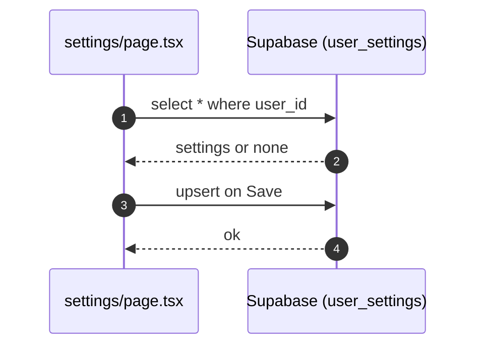

# Settings

- Source: `app/settings/page.tsx`

## What it has
- Account info (email, created date), language/timezone, auto-save.
- Notifications toggles.
- Privacy/data export + delete stub.
- AI Settings: personal API keys via `ApiKeyManager`.

## How it works
- Loads/saves `public.user_settings` with Supabase client (`supabase.from('user_settings')`).
- Password change using `supabase.auth.updateUser({ password })`.
- Export assembles local JSON (no server call).

## Auth & security
- Route protected by `middleware.ts` (`/settings`).
- RLS on `user_settings` rows keyed by `user_id`.

## Data
- Table: `user_settings` (email_notifications, research_updates, collaboration_invites, security_alerts, marketing_emails, theme, language, timezone, auto_save, data_sharing).

## Errors & tests
- Toast on save/change password failures.
- Tests: save round-trip with RLS; password mismatch; export JSON shape.

## Sequence

