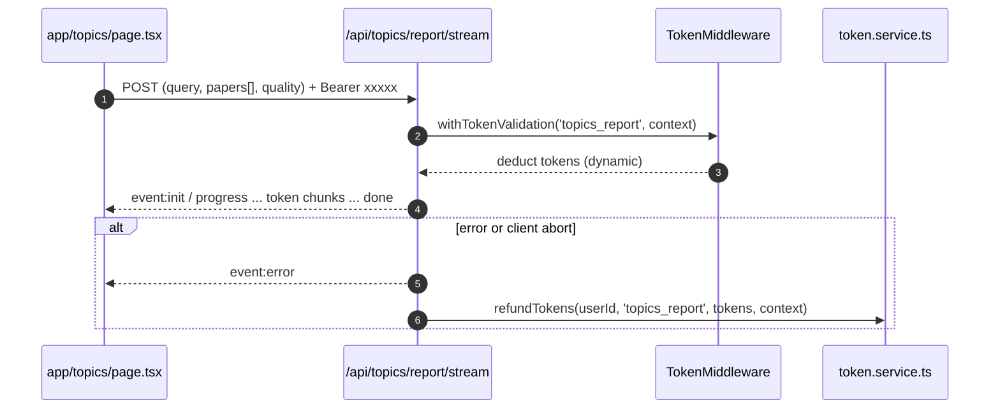

# Find Topics

- Source: `app/topics/page.tsx`

## What is here
- Search for papers (aggregated), extract topics, and generate a scholarly report via SSE.
- UI has progress steps, Insights & Next Actions, streaming Report, and Sources.

## Why it is used
- Provide topic discovery and long-form report synthesis grounded in sources.

## How it works
- Uses `useLiteratureSearch({ useSSE: true, aggregateWindowMs: 120000 })` to search with aggregation and rate-limit awareness.
- Extracts topics by POSTing to `/api/topics/extract?quality=<Standard|Enhanced>&limit=<n>` (client code sends fetch; route may be elsewhere under `app/api/topics/extract/`).
- Streams report with manual `fetch()` + `ReadableStream` from `POST /api/topics/report/stream?quality=<>&limit=<n>` and parses SSE events `token`, `done`, `error`.
- Client enforces 4-minute timeout via `AbortController` and cleans intervals on unmount.

## APIs & Integrations
- Literature search: `app/api/literature-search/route.ts` (GET/POST), aggregation window clamped to 24h.
- Report streaming: `app/api/topics/report/stream/route.ts` with stage timeouts and explicit token refunds on error/abort.
- Token service: `lib/middleware/token-middleware.ts` + `lib/services/token.service.ts` (dynamic costs based on `quality` and `limit` via `get_feature_cost`).

## Authentication and Authorization
- Page protected by `middleware.ts` (`/topics`).
- API routes authenticate via `withTokenValidation('literature_search' | 'topics_report', ...)` and Supabase session headers/cookies.

## Security Practices
- SSE heartbeats every 15s; client abort observed by server to close and refund tokens.
- Input validation on API side for query length, citation mode seed, and aggregate window.

## Data Storage
- Literature caching: `public.literature_cache` (when configured).
- Usage tracking: `public.literature_search_usage`.

## Billing / Tokens
- Literature search: dynamic per-result pricing via context `per_result`.
- Report: `topics_report` dynamic cost via `quality` and `limit`; explicit refunds on error/abort.

## Middleware
- `withTokenValidation()` wraps both search and report routes; explorer bypass does not apply here.

## Error Handling
- Client: shows rate-limit countdown from `Retry-After`; reports specific timeout message.
- Server: emits SSE `error` and closes, then refunds tokens.

## Tests
- Unit: SSE parser for report (`event:` + `data:` blocks).
- Black box: simulate server abort to verify client displays timeout and server refunds.

## Sequence (Report)

## Related Files
- `app/topics/page.tsx`
- `app/api/literature-search/route.ts`
- `app/api/topics/report/stream/route.ts`
- `lib/middleware/token-middleware.ts`
- `lib/services/token.service.ts`
