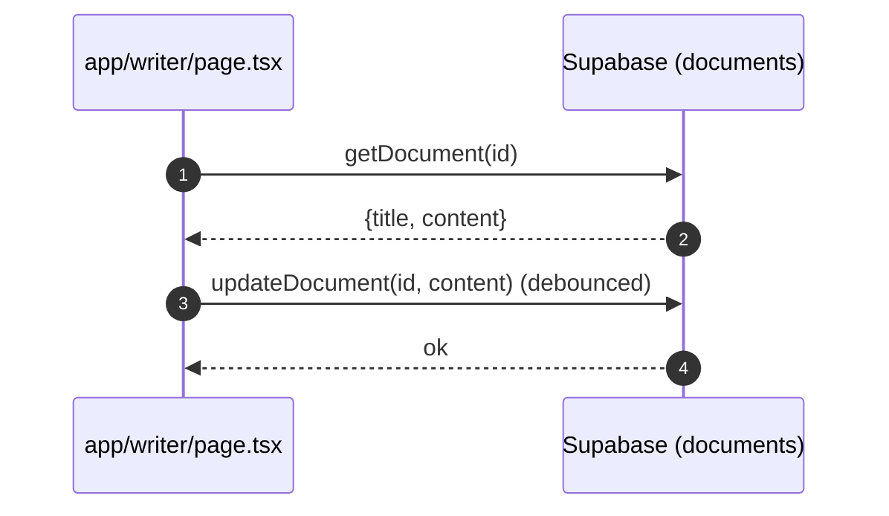

# Writer (AI Writer) - Unified Document Editor

- Source: `app/writer/page.tsx`
- Route: `/writer`
- Status: ✅ **FULLY FUNCTIONAL & OPTIMIZED** (Cleaned & Merged October 2025)

> **Note**: This is the unified document editor that combines all writing and collaboration features.
> The previous separate "Writing Assistant" page has been merged into this single, optimized page.
> **Code cleanup**: Removed ~270 lines of dead placeholder code for better maintainability.

## What is here
- Full document editor with LaTeX export, citation manager, AI writing assistant, AI detection, and sharing.
- **Google Docs-style editing experience** with floating toolbar and AI-powered context menu
- Uses `DocumentService`, `CitationManager`, `AiWritingAssistant`, `LaTeXEditor`, `FloatingToolbar`, `EditorContextMenu`.

## Why it is used
- Compose, manage, and export research documents with integrated AI assistance and citations.
- Modern text editing with real-time AI enhancements, translations, and formatting.

## ✅ Verified Features (October 2025)

### 1. Floating Toolbar ✅ WORKING
**Location**: `app/writer/page.tsx:1563` (outside scroll container)

- **Appears on text selection** - Google Docs-style floating toolbar
- **Formatting options**: Bold, Italic, Underline, Highlight
- **Headings**: H1, H2, H3
- **Lists**: Bullet points, Numbered lists
- **Insert**: Links, Code blocks, Quotes
- **Alignment**: Left, Center, Right
- **Component**: `app/writer/components/floating-toolbar.tsx`
- **Handler**: `handleFloatingToolbarFormat` (lines 803-857)

**Fix Applied**: Moved FloatingToolbar outside `<ScrollArea>` to prevent clipping by `overflow-hidden`

### 2. Enhanced Context Menu ✅ WORKING
**Location**: `app/writer/page.tsx:1146-1161`

**Standard Actions**:
- ✅ Copy, Cut, Paste (Modern Clipboard API)
- ✅ Error handling with user feedback toasts

**AI Writing Tools** (lines 949-1020):
- ✅ **Improve Writing** - Enhances text for academic writing
- ✅ **Summarize** - Condenses text concisely
- ✅ **Expand** - Adds detail and examples
- ✅ **Simplify** - Makes text easier to understand
- ✅ **Make Formal** - Academic tone conversion
- ✅ **Make Casual** - Conversational tone conversion

**Translation Feature** (lines 1022-1090):
- ✅ **6 Languages**: Spanish, French, German, Chinese, Japanese, Arabic
- ✅ Uses `/api/ai/chat` endpoint with Nova AI
- ✅ Replaces selected text in-place
- ✅ Loading states and error handling

**Search Integration** (lines 1092-1104):
- ✅ Opens Google Scholar in new tab
- ✅ Searches selected text automatically

**Component**: `app/writer/components/editor-context-menu.tsx`

### 3. Technical Improvements ✅
- ✅ **Modern Clipboard API** - Using `navigator.clipboard` (not deprecated `document.execCommand`)
- ✅ **Proper Error Handling** - Try-catch blocks with user feedback
- ✅ **AI Integration** - Real API calls to `/api/ai/chat` endpoint
- ✅ **State Management** - Direct content updates via `setDocumentContent`
- ✅ **Loading States** - Toast notifications during AI processing
- ✅ **Text Replacement** - Accurate index-based text substitution

## How it works
- Reads/creates documents via `lib/services/document.service.ts` (ID from `?id=` query param).
- Auto-saves with debounce to Supabase via DocumentService.
- AI assistant uses provider/model state and injects text into editor.
- Export functions generate `.tex` and `.bib` or Markdown from editor content.
- **Floating toolbar** appears automatically when text is selected using browser Selection API
- **Context menu** wraps LaTeXEditor with right-click functionality

## Editor Features

### Text Selection Tools
- **Floating Toolbar** - Appears above selected text with formatting options
- **Context Menu** - Right-click for advanced actions including AI tools
- **Keyboard Shortcuts** - Standard editing shortcuts supported
- **Real-time Preview** - See changes immediately in split view mode

### AI-Powered Editing
- **AI Writing Assistant** - Generate, improve, and refine content
- **Smart Formatting** - Automatic markdown formatting for selected text
- **Translation** - Translate selected text to 6+ languages
- **Content Analysis** - AI detection and humanization tools

## 🎯 How to Use

### 1. Select Text + Format
1. **Highlight** any text in the editor
2. **FloatingToolbar** appears automatically above selection
3. Click formatting buttons (Bold, Italic, Heading, etc.)
4. Formatting applied instantly

### 2. Right-Click + AI Tools
1. **Select** text you want to enhance
2. **Right-click** to open context menu
3. Choose from AI options:
   - **Improve** - Make text more academic
   - **Summarize** - Create concise version
   - **Expand** - Add more details
   - **Simplify** - Easier to read
   - **Formal/Casual** - Change tone
   - **Translate** - Convert to another language
4. Watch as AI processes and replaces text

### 3. Search Scholar
1. **Select** a term or phrase
2. **Right-click** → **Search**
3. Google Scholar opens in new tab

## 📡 API Integration

### Endpoint Used
```
POST /api/ai/chat
```

### Request Format
```json
{
  "message": "Improve this text for academic writing:\n\n[selected text]",
  "context": {
    "actionType": "writing_assistance",
    "documentContent": "[full document content]"
  }
}
```

### Response Format
```json
{
  "response": "[AI-generated result]",
  "content": "[alternative field name]"
}
```

### Supported Actions
- `improve` - Enhance for academic writing
- `summarize` - Condense text
- `expand` - Add detail
- `simplify` - Make easier to understand
- `formal` - Academic tone
- `casual` - Conversational tone
- Translation prompts for 6 languages

## APIs & Integrations
- Documents CRUD via internal API routes `/api/documents` and `/api/documents/[id]` that `lib/services/document.service.ts` calls with a Supabase bearer token. Note: these routes are not present in this repo snapshot; implement them to persist documents.
- AI Detection badge uses `AIDetectionBadge` and `ai-detection.service` (client-side).

## Authentication and Authorization
- Protected by `middleware.ts` (`/writer`).
- Supabase auth checked in page to enable editing/saving.

## Security Practices
- User-bound selects and updates (`owner`-scoped) by `DocumentService` with RLS.
- Avoids leaking tokens; client obtains session via Supabase SDK.

## Data Storage
- Intended table: `public.documents` (title, content, metadata, team/project bindings). The backing API routes are missing in this snapshot; ensure they write to `public.documents` with RLS enforcing `owner_id = auth.uid()`.
- Related tables: citations (see Citation Generator page).

## Billing / Tokens
- Writing/editor actions do not consume tokens by themselves.

## Middleware
- Route protection only.

## Error Handling
- Toasts around all async operations; `useGlobalErrorHandler` utility centralizes messaging.

## Tests
- Unit: debounce save, export helpers, LaTeX template building.
- Black box: open page as authenticated user, edit and verify DB updates via `DocumentService`.

## Sequence


## Related Files
- `app/writer/page.tsx`
- `lib/services/document.service.ts`
- `components/writer/*`
