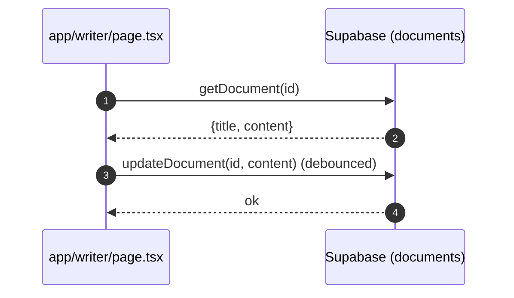

# Writer (AI Writer)

- Source: `app/writer/page.tsx`

## What is here
- Full document editor with LaTeX export, citation manager, AI writing assistant, AI detection, and sharing.
- Uses `DocumentService`, `CitationManager`, `AiWritingAssistant`, `LaTeXEditor`.

## Why it is used
- Compose, manage, and export research documents with integrated AI assistance and citations.

## How it works
- Reads/creates documents via `lib/services/document.service.ts` (ID from `?id=` query param).
- Auto-saves with debounce to Supabase via DocumentService.
- AI assistant uses provider/model state and injects text into editor.
- Export functions generate `.tex` and `.bib` or Markdown from editor content.

## APIs & Integrations
- Documents CRUD via internal API routes `/api/documents` and `/api/documents/[id]` that `lib/services/document.service.ts` calls with a Supabase bearer token. Note: these routes are not present in this repo snapshot; implement them to persist documents.
- AI Detection badge uses `AIDetectionBadge` and `ai-detection.service` (client-side).

## Authentication and Authorization
- Protected by `middleware.ts` (`/writer`).
- Supabase auth checked in page to enable editing/saving.

## Security Practices
- User-bound selects and updates (`owner`-scoped) by `DocumentService` with RLS.
- Avoids leaking tokens; client obtains session via Supabase SDK.

## Data Storage
- Intended table: `public.documents` (title, content, metadata, team/project bindings). The backing API routes are missing in this snapshot; ensure they write to `public.documents` with RLS enforcing `owner_id = auth.uid()`.
- Related tables: citations (see Citation Generator page).

## Billing / Tokens
- Writing/editor actions do not consume tokens by themselves.

## Middleware
- Route protection only.

## Error Handling
- Toasts around all async operations; `useGlobalErrorHandler` utility centralizes messaging.

## Tests
- Unit: debounce save, export helpers, LaTeX template building.
- Black box: open page as authenticated user, edit and verify DB updates via `DocumentService`.

## Sequence

## Related Files
- `app/writer/page.tsx`
- `lib/services/document.service.ts`
- `components/writer/*`
