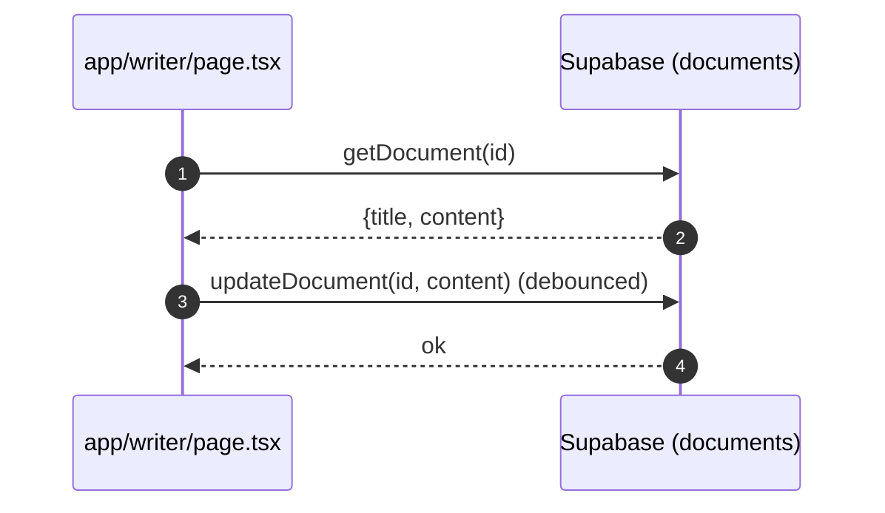

# Writer (AI Writer)

- Source: `app/writer/page.tsx`

## What is here
- Full document editor with LaTeX export, citation manager, AI writing assistant, AI detection, and sharing.
- **New:** Floating toolbar and rich context menu for enhanced text editing
- Uses `DocumentService`, `CitationManager`, `AiWritingAssistant`, `LaTeXEditor`, `FloatingToolbar`, `EditorContextMenu`.

## Why it is used
- Compose, manage, and export research documents with integrated AI assistance and citations.
- Modern Google Docs-style editing experience with floating formatting tools.

## Recent Updates (October 2025)

### Floating Toolbar & Context Menu
- **Floating Toolbar** - Google Docs-style floating toolbar that appears when text is selected
  - Formatting: Bold, Italic, Underline, Highlight
  - Headings: H1, H2, H3
  - Lists: Bullet points, Numbered lists
  - Insert: Links, Code blocks, Quotes
  - Alignment: Left, Center, Right
  - Files: `app/writer/components/floating-toolbar.tsx`

- **Enhanced Context Menu** - Rich right-click menu with AI-powered tools
  - Standard actions: Copy, Cut, Paste
  - AI Writing Tools: Improve, Summarize, Expand, Simplify, Make Formal/Casual
  - Translate: Multiple languages (Spanish, French, German, Chinese, Japanese, Arabic)
  - Search: Quick search for selected text
  - Files: `app/writer/components/editor-context-menu.tsx`

- **Modern Clipboard API** - Replaced deprecated `document.execCommand()` with modern `navigator.clipboard` API
- **Improved Error Handling** - All clipboard operations now have try-catch blocks with user feedback
- Files updated: `app/writer/page.tsx:802-902`, `app/writer/page.tsx:1076-1094`

### Technical Improvements
- **Fixed TypeScript errors** - Resolved `document` variable conflicts
- **Better state management** - Direct content updates instead of DOM manipulation
- **Enhanced UX** - Smooth animations and dark-themed toolbar

## How it works
- Reads/creates documents via `lib/services/document.service.ts` (ID from `?id=` query param).
- Auto-saves with debounce to Supabase via DocumentService.
- AI assistant uses provider/model state and injects text into editor.
- Export functions generate `.tex` and `.bib` or Markdown from editor content.
- **Floating toolbar** appears automatically when text is selected using browser Selection API
- **Context menu** wraps LaTeXEditor with right-click functionality

## Editor Features

### Text Selection Tools
- **Floating Toolbar** - Appears above selected text with formatting options
- **Context Menu** - Right-click for advanced actions including AI tools
- **Keyboard Shortcuts** - Standard editing shortcuts supported
- **Real-time Preview** - See changes immediately in split view mode

### AI-Powered Editing
- **AI Writing Assistant** - Generate, improve, and refine content
- **Smart Formatting** - Automatic markdown formatting for selected text
- **Translation** - Translate selected text to multiple languages
- **Content Analysis** - AI detection and humanization tools

## APIs & Integrations
- Documents CRUD via internal API routes `/api/documents` and `/api/documents/[id]` that `lib/services/document.service.ts` calls with a Supabase bearer token. Note: these routes are not present in this repo snapshot; implement them to persist documents.
- AI Detection badge uses `AIDetectionBadge` and `ai-detection.service` (client-side).

## Authentication and Authorization
- Protected by `middleware.ts` (`/writer`).
- Supabase auth checked in page to enable editing/saving.

## Security Practices
- User-bound selects and updates (`owner`-scoped) by `DocumentService` with RLS.
- Avoids leaking tokens; client obtains session via Supabase SDK.

## Data Storage
- Intended table: `public.documents` (title, content, metadata, team/project bindings). The backing API routes are missing in this snapshot; ensure they write to `public.documents` with RLS enforcing `owner_id = auth.uid()`.
- Related tables: citations (see Citation Generator page).

## Billing / Tokens
- Writing/editor actions do not consume tokens by themselves.

## Middleware
- Route protection only.

## Error Handling
- Toasts around all async operations; `useGlobalErrorHandler` utility centralizes messaging.

## Tests
- Unit: debounce save, export helpers, LaTeX template building.
- Black box: open page as authenticated user, edit and verify DB updates via `DocumentService`.

## Sequence

## Related Files
- `app/writer/page.tsx`
- `lib/services/document.service.ts`
- `components/writer/*`
