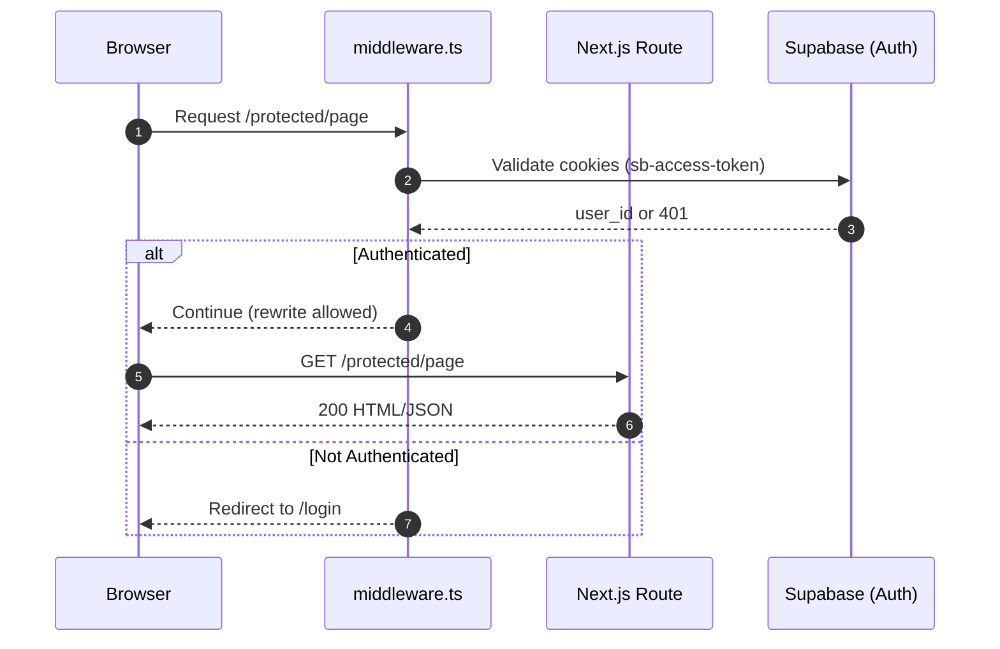
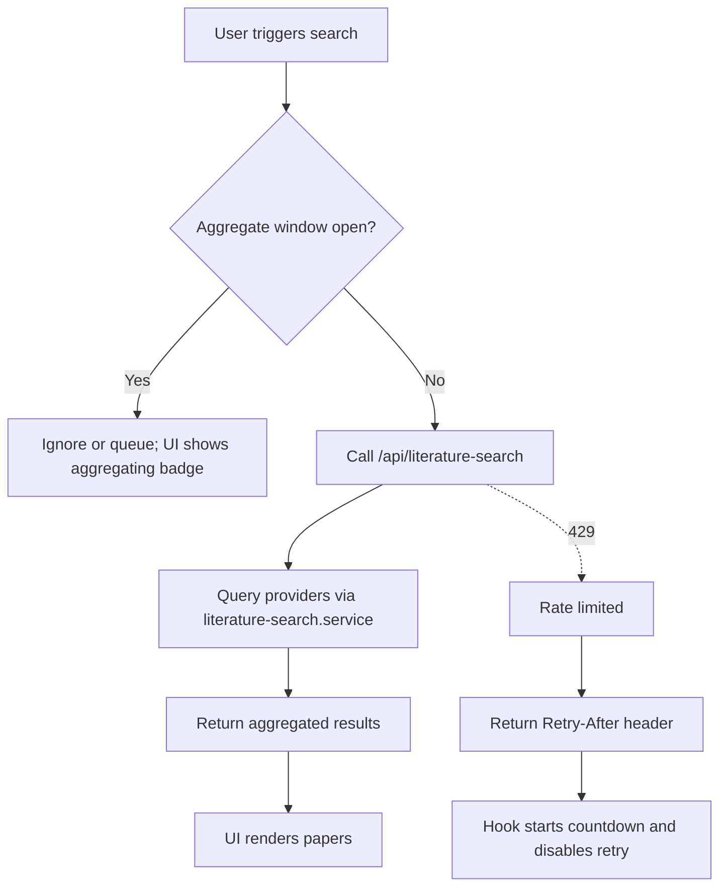
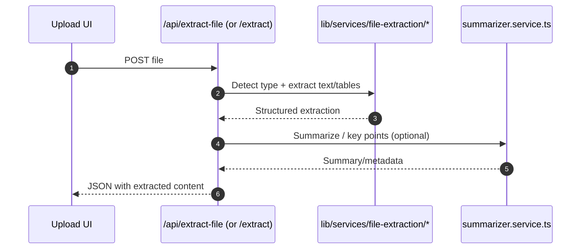
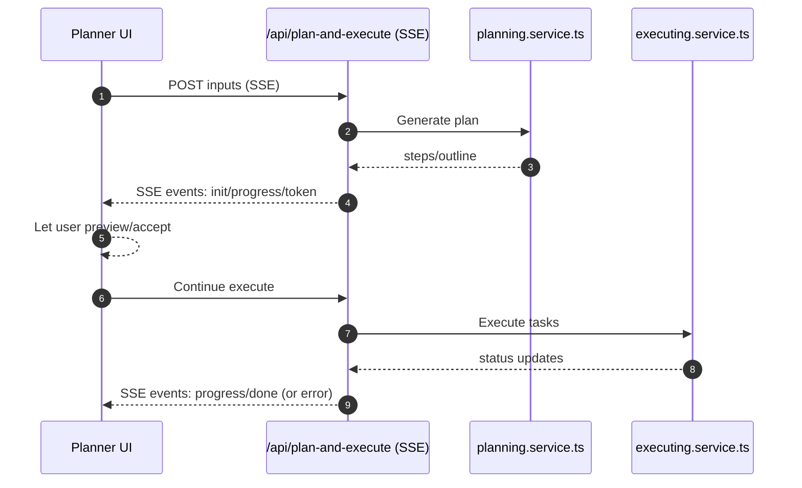
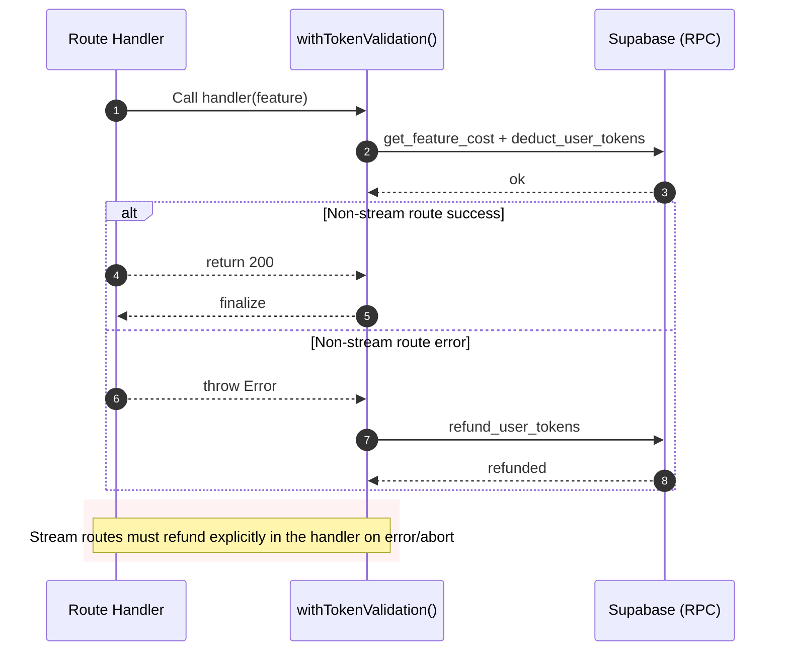
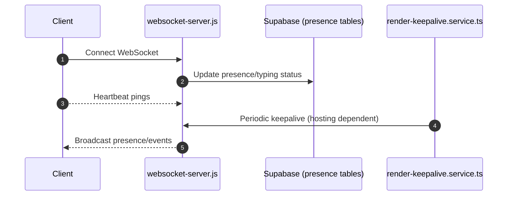

# Sequences and Flows

This file contains the core end-to-end flows for ThesisFlow-AI expressed as Mermaid diagrams. Use these to understand runtime behavior and contracts quickly.

## Auth and route protection


## Topics: literature search → scholarly report (SSE)
```mermaid
sequenceDiagram
    autonumber
    participant UI as app/topics/page.tsx
    participant L as /api/literature-search
    participant LS as literature-search.service.ts
    participant EXT as External APIs (OpenAlex, arXiv, CrossRef, CSE, Tavily, ...)
    participant T as /api/topics/report/stream
    participant OR as OpenRouter (LLM)
    participant SUPA as Supabase (tokens)

    UI->>L: POST search query (respect aggregate window)
    L->>LS: Resolve providers + cache
    loop Providers
      LS->>EXT: Query source
      EXT-->>LS: Results
    end
    LS-->>L: Aggregated results
    L-->>UI: JSON papers

    UI->>T: POST {query, papers, quality}&limit (SSE)
    T->>SUPA: withTokenValidation() → deduct tokens (get_feature_cost)
    SUPA-->>T: deducted

    T-->>UI: SSE event: init
    T->>OR: Curate sources (stage 1) with timeout
    OR-->>T: Progress/tokens
    T-->>UI: SSE events: progress/token
    T->>OR: Analyze (stage 2) with timeout
    OR-->>T: Progress/tokens
    T-->>UI: SSE events: progress/token
    T->>OR: Synthesize (stage 3) with timeout
    OR-->>T: Final tokens
    T-->>UI: SSE event: done

    UI-->>UI: Render markdown progressively

    rect rgba(255,213,213,0.3)
    note over UI,T,SUPA: On error or client abort → emit SSE error and REFUND tokens with same context
    end
```

## Literature search: aggregation and rate-limit flow


## AI Chat streaming with fallback
```mermaid
sequenceDiagram
    autonumber
    participant UI as ResearchAssistant (EventSource)
    participant C as /api/ai/chat/stream
    participant P as ai-providers.ts
    participant OR as OpenRouter

    UI->>C: EventSource connect (withCredentials: true; cookie auth)
    C->>P: Generate with primary model
    alt Model unsupported / 400
      P->>OR: Try next fallback
    else OK
      P->>OR: Stream tokens
    end
    OR-->>C: token chunks
    C-->>UI: SSE events: init/token/progress/done
    note over C,UI: On fatal failure → SSE error, close stream
```

## Extraction orchestrator


## Planner: plan-and-execute (SSE)


## Tokens: deduct and refund


## WebSocket presence and keepalive


## References
- SSE routes: `app/api/ai/chat/stream/route.ts`, `app/api/topics/report/stream/route.ts`, `app/api/plan-and-execute/route.ts`
- Hooks: `hooks/use-literature-search.ts`, `hooks/use-chat-socket.ts`, `hooks/use-plan-and-execute.ts`
- Services: `lib/services/literature-search.service.ts`, `lib/services/openrouter.service.ts`, `lib/services/topic-report-agents.ts`, `lib/services/file-extraction/*`, `lib/services/planning.service.ts`, `lib/services/executing.service.ts`, `lib/services/token.service.ts`
- Middleware: `lib/middleware/token-middleware.ts`
- Supabase URL: xxxxx
