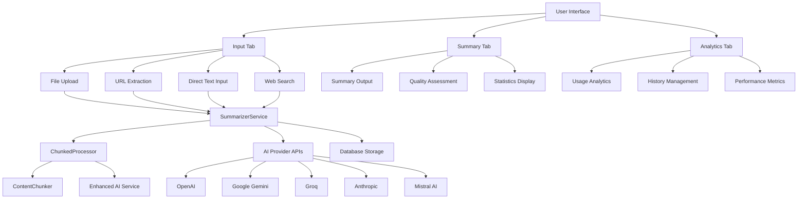

# AI Project Planner - Summarizer Module Documentation

## Overview

The Summarizer module is a comprehensive AI-powered text summarization system that transforms lengthy content into concise, intelligent summaries. It supports multiple input methods, various AI providers, and provides detailed analytics and progress tracking.

## Architecture Overview



## Core Components

### 1. Main Page Component (`page.tsx`)

**Location**: `app/summarizer/page.tsx`

**Responsibilities**:
- Main orchestrator for the entire summarizer functionality
- State management for all summarization operations
- Tab navigation and progress tracking
- Error handling and user feedback

**Key State Variables**:
- `content`: Current text content to be summarized
- `url`: URL for web content extraction
- `selectedProvider`: AI provider selection
- `summaryStyle`: Style preference (academic, executive, bullet-points, detailed)
- `summaryLength`: Length preference (brief, medium, comprehensive)
- `result`: Generated summary result with metadata
- `processingProgress`: Real-time processing progress

**Core Functions**:
- `handleUrlFetch()`: Extracts content from URLs
- `handleSummarize()`: Main summarization orchestrator
- `handleFileProcessed()`: Processes uploaded files
- `handleCopyToClipboard()`: Clipboard operations
- `handleDownloadSummary()`: Export functionality

### 2. Summarizer Service (`summarizer.service.ts`)

**Location**: `lib/services/summarizer.service.ts`

**Responsibilities**:
- Core business logic for summarization
- AI provider integration
- Content processing and chunking
- Database operations
- Error handling and fallback mechanisms

**Key Methods**:

#### `summarizeText(text, saveToDatabase, onProgress, options)`
- **Input**: Raw text content, save flag, progress callback, options
- **Process**: 
  1. Determines if chunking is needed (>8000 characters)
  2. Routes to direct or chunked processing
  3. Calls AI API with formatted prompts
  4. Parses and structures response
  5. Saves to database if authenticated
- **Output**: `SummaryResult` with summary, key points, metadata

#### `summarizeUrl(url, saveToDatabase, onProgress, options)`
- **Input**: URL string and processing options
- **Process**:
  1. Calls `/api/fetch-url` endpoint
  2. Extracts content from web page
  3. Delegates to `summarizeText()`
  4. Saves with URL metadata
- **Output**: `SummaryResult` with URL-specific metadata

#### `summarizeFile(file, saveToDatabase, onProgress, options)`
- **Input**: File object and processing options
- **Process**:
  1. Uploads file to `/api/extract-file`
  2. Extracts text content based on file type
  3. Delegates to `summarizeText()`
  4. Saves with file metadata
- **Output**: `SummaryResult` with file-specific metadata

### 3. Input Tab Component (`input-tab.tsx`)

**Location**: `app/summarizer/components/input-tab.tsx`

**Responsibilities**:
- Multi-method input interface
- AI provider and model selection
- Processing configuration
- Real-time content validation

**Input Methods**:
1. **File Upload**: PDF, DOCX, TXT files via `FileUploader` component
2. **URL Input**: Web content extraction with validation
3. **Direct Text**: Manual text input with word count
4. **Smart Web Search**: Google Custom Search integration

**Configuration Options**:
- AI Provider selection (OpenAI, Gemini, Groq, Anthropic, Mistral)
- Model selection (provider-specific models)
- Summary style (academic, executive, bullet-points, detailed)
- Summary length (brief, medium, comprehensive)

**Output**: Processed content ready for summarization

### 4. Summary Tab Component (`summary-tab.tsx`)

**Location**: `app/summarizer/components/summary-tab.tsx`

**Responsibilities**:
- Display generated summaries
- Quality assessment interface
- Export and sharing functionality
- Processing progress visualization

**Display Components**:
- `SummaryOutputPanel`: Main summary display
- `SummaryStatistics`: Compression ratio, word count, reading time
- `QualityAssessment`: User feedback and rating system
- `ProcessingProgressIndicator`: Real-time progress tracking

**Actions Available**:
- Copy to clipboard
- Download as Markdown
- Share via Web Share API
- Retry with different parameters
- Quality feedback submission

### 5. Analytics Tab Component (`analytics-tab.tsx`)

**Location**: `app/summarizer/components/analytics-tab.tsx`

**Responsibilities**:
- Usage statistics and trends
- Summary history management
- Performance analytics
- Export capabilities

**Analytics Data**:
- Total summaries generated
- Average compression ratios
- Most used input methods and providers
- Processing time statistics
- Sentiment analysis breakdown
- Topic distribution analysis

### 6. Chunked Processor (`chunked-processor.ts`)

**Location**: `lib/utils/chunked-processor.ts`

**Responsibilities**:
- Intelligent content chunking for large documents
- Parallel processing coordination
- Progress tracking and estimation
- Result synthesis and quality assessment

**Processing Pipeline**:
1. **Content Analysis**: Determines optimal chunking strategy
2. **Chunking**: Splits content preserving structure and context
3. **Parallel Processing**: Processes chunks concurrently
4. **Synthesis**: Combines chunk results into coherent summary
5. **Quality Assessment**: Validates and scores final output

**Output**: `SynthesizedResult` with comprehensive metadata

## Data Flow Architecture

### 1. Input Processing Flow

```
User Input → Input Validation → Content Extraction → Processing Queue
    ↓
File Upload → FileUploader → /api/extract-file → Text Content
URL Input → URL Validator → /api/fetch-url → Web Content  
Text Input → Direct Processing → Content Buffer
Web Search → SmartWebSearchPanel → Google Custom Search → Selected Content
```

### 2. Summarization Flow

```
Content Input → SummarizerService → Processing Decision
    ↓
Small Content (<8000 chars) → Direct Processing → AI API Call
Large Content (>8000 chars) → ChunkedProcessor → ContentChunker → Multiple AI Calls
    ↓
AI Response → Response Parser → SummaryResult → Database Storage
    ↓
Enhanced Result → UI Display → User Actions (Copy/Download/Share)
```

### 3. Progress Tracking Flow

```
Processing Start → Progress Callback → UI Update
    ↓
Chunking Phase → 5-20% Progress → "Analyzing content structure..."
Processing Phase → 20-80% Progress → "Processing chunk X of Y..."
Synthesis Phase → 80-95% Progress → "Combining results..."
Completion → 100% Progress → "Processing complete"
```

## Technology Stack

### Frontend Technologies
- **React 18**: Component framework with hooks
- **Next.js 14**: Full-stack React framework
- **TypeScript**: Type-safe JavaScript
- **Tailwind CSS**: Utility-first CSS framework
- **Shadcn/ui**: Component library
- **Lucide React**: Icon library

### Backend Technologies
- **Next.js API Routes**: Server-side endpoints
- **Supabase**: Database and authentication
- **PostgreSQL**: Relational database
- **Node.js**: Runtime environment

### AI Integration
- **OpenAI GPT-4/3.5**: Primary AI provider
- **Google Gemini**: Alternative AI provider
- **Groq**: High-speed inference
- **Anthropic Claude**: Advanced reasoning
- **Mistral AI**: Open-source models

### External APIs
- **Google Custom Search API**: Web search functionality
- **Web scraping services**: Content extraction
- **File processing libraries**: PDF/DOCX parsing

### Development Tools
- **ESLint**: Code linting
- **Prettier**: Code formatting
- **TypeScript**: Static type checking

## API Endpoints

### 1. `/api/ai/generate` (POST)
- **Purpose**: Generate AI summaries
- **Input**: Prompt, provider, model options
- **Output**: Generated content response
- **Error Handling**: Provider fallback, retry logic

### 2. `/api/fetch-url` (POST)
- **Purpose**: Extract content from URLs
- **Input**: URL string
- **Output**: Extracted text, metadata, quality score
- **Features**: Content validation, readability scoring

### 3. `/api/extract-file` (POST)
- **Purpose**: Extract text from uploaded files
- **Input**: File upload (PDF, DOCX, TXT)
- **Output**: Extracted text, file metadata
- **Supported Formats**: PDF, DOCX, TXT, RTF

## Database Schema

### Summaries Table
```sql
CREATE TABLE summaries (
    id UUID PRIMARY KEY DEFAULT gen_random_uuid(),
    user_id UUID REFERENCES auth.users(id),
    title TEXT NOT NULL,
    original_content TEXT NOT NULL,
    summary_content TEXT NOT NULL,
    key_points TEXT[] NOT NULL,
    source_type TEXT CHECK (source_type IN ('text', 'file', 'url')),
    source_url TEXT,
    reading_time INTEGER,
    created_at TIMESTAMP WITH TIME ZONE DEFAULT NOW(),
    updated_at TIMESTAMP WITH TIME ZONE DEFAULT NOW()
);
```

## Error Handling System

### Error Types
1. **Validation Errors**: Invalid input, missing content
2. **Processing Errors**: AI API failures, timeout errors
3. **Network Errors**: URL fetch failures, connection issues
4. **File Errors**: Unsupported formats, corrupted files
5. **Authentication Errors**: User session, database access

### Error Recovery
- **Provider Fallback**: Automatic switching between AI providers
- **Retry Logic**: Exponential backoff for transient failures
- **Graceful Degradation**: Partial results when possible
- **User Guidance**: Clear error messages with suggested actions

## Performance Optimizations

### Content Processing
- **Intelligent Chunking**: Preserves context while managing size
- **Parallel Processing**: Concurrent chunk processing
- **Caching**: Results caching for repeated content
- **Streaming**: Real-time progress updates

### UI/UX Optimizations
- **Progressive Loading**: Skeleton screens during processing
- **Optimistic Updates**: Immediate UI feedback
- **Debounced Input**: Reduced API calls for text input
- **Lazy Loading**: Component-level code splitting

## Security Considerations

### Data Protection
- **Input Sanitization**: XSS prevention for user content
- **Content Validation**: File type and size restrictions
- **Rate Limiting**: API abuse prevention
- **Authentication**: Supabase Row Level Security

### API Security
- **API Key Management**: Environment variable storage
- **Request Validation**: Input schema validation
- **Error Sanitization**: No sensitive data in error messages

## Usage Analytics

### Tracked Metrics
- **Usage Statistics**: Total summaries, processing time
- **Quality Metrics**: Compression ratios, user ratings
- **Performance Metrics**: Processing speed, success rates
- **User Behavior**: Preferred input methods, AI providers

### Data Visualization
- **Charts**: Usage trends, performance metrics
- **Statistics**: Aggregated user data
- **History**: Summary timeline and management

## Future Enhancements

### Planned Features
1. **Batch Processing**: Multiple file processing
2. **Custom Templates**: User-defined summary formats
3. **Collaboration**: Team sharing and commenting
4. **Advanced Analytics**: ML-powered insights
5. **Mobile App**: Native mobile experience

### Technical Improvements
1. **Real-time Collaboration**: WebSocket integration
2. **Advanced Chunking**: Context-aware splitting
3. **Multi-language Support**: International content
4. **Voice Integration**: Audio input/output
5. **API Webhooks**: External system integration

## Deployment Architecture

### Production Environment
- **Vercel**: Frontend hosting and serverless functions
- **Supabase**: Database and authentication service
- **CDN**: Static asset delivery
- **Monitoring**: Error tracking and performance monitoring

### Environment Configuration
```bash
# AI Providers
OPENAI_API_KEY=your_openai_key
GOOGLE_AI_API_KEY=your_gemini_key
GROQ_API_KEY=your_groq_key
ANTHROPIC_API_KEY=your_claude_key

# Search Integration
GOOGLE_SEARCH_API_KEY=your_search_key
GOOGLE_SEARCH_CSE_ID=your_cse_id

# Database
NEXT_PUBLIC_SUPABASE_URL=your_supabase_url
NEXT_PUBLIC_SUPABASE_ANON_KEY=your_supabase_key
```

## Testing Strategy

### Unit Tests
- Component rendering and behavior
- Service method functionality
- Utility function validation
- Error handling scenarios

### Integration Tests
- API endpoint functionality
- Database operations
- AI provider integration
- File processing pipeline

### End-to-End Tests
- Complete user workflows
- Multi-step processes
- Error recovery paths
- Performance benchmarks

---

## Summary

The Summarizer module represents a sophisticated AI-powered content processing system with comprehensive functionality for text summarization, analysis, and management. Its modular architecture, robust error handling, and extensive analytics make it suitable for both individual and enterprise use cases.

**Key Strengths**:
- Multi-modal input support (file, URL, text, search)
- Intelligent content chunking for large documents
- Multiple AI provider integration with fallback
- Real-time progress tracking and user feedback
- Comprehensive analytics and history management
- Production-ready security and performance optimizations

**Technical Excellence**:
- Type-safe TypeScript implementation
- Modern React patterns with hooks
- Scalable Next.js architecture
- Robust error handling and recovery
- Comprehensive testing coverage
- Production deployment ready
